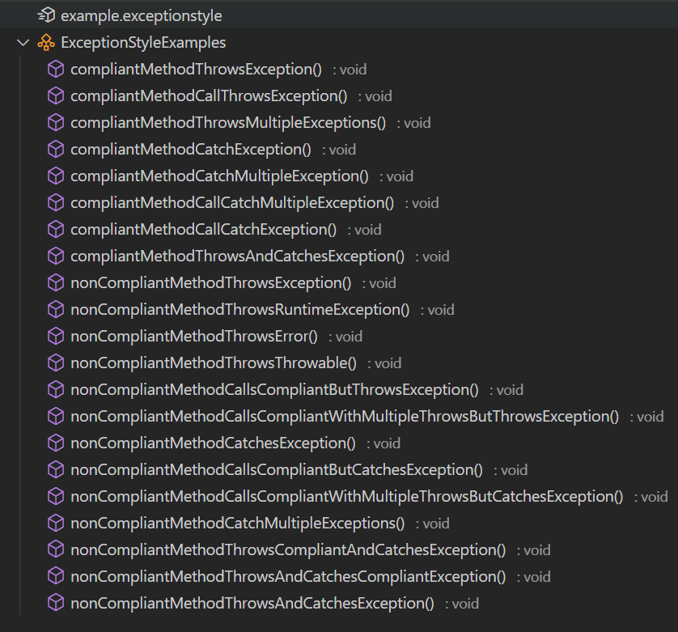
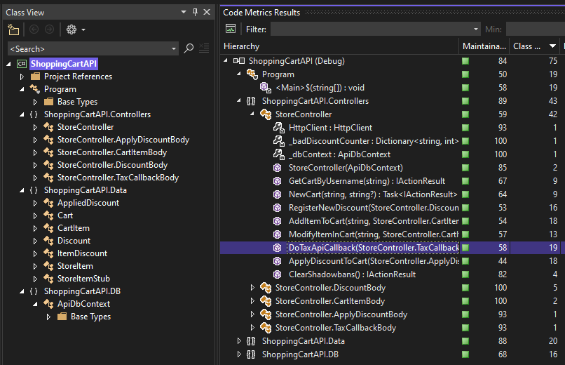
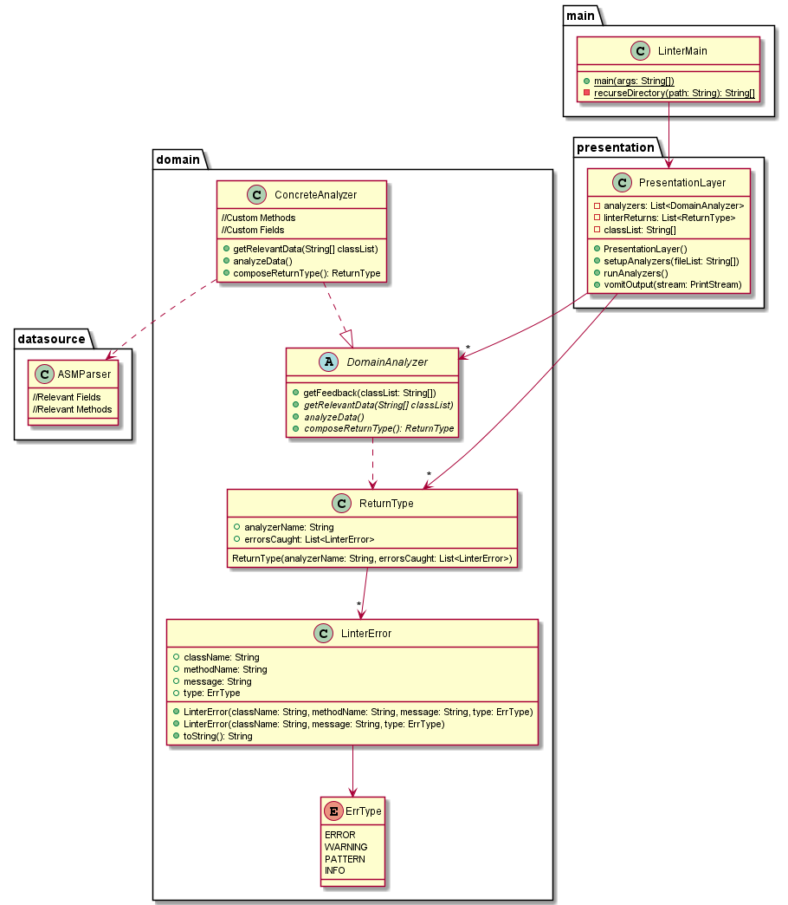
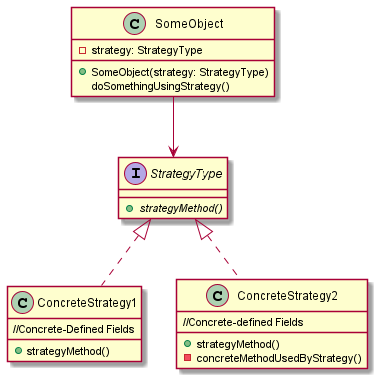
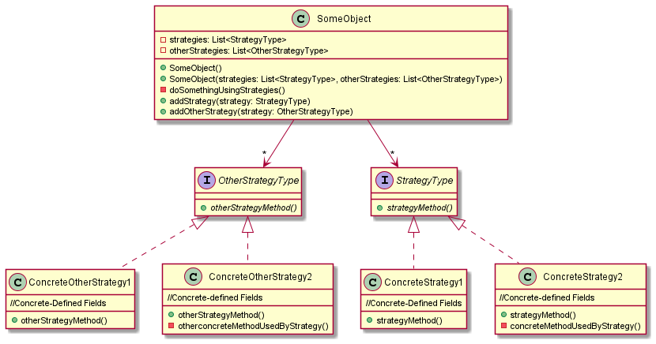
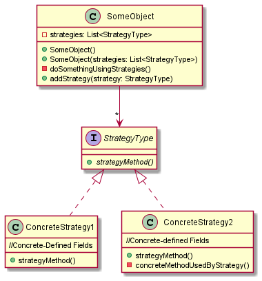
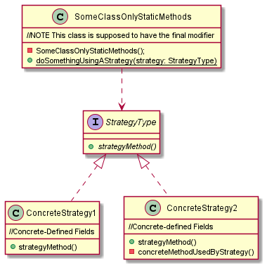
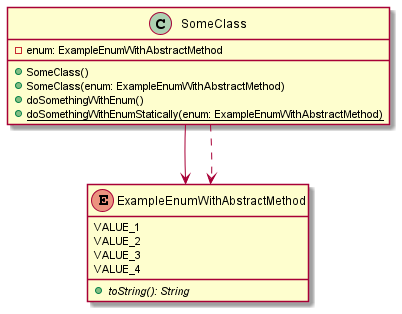
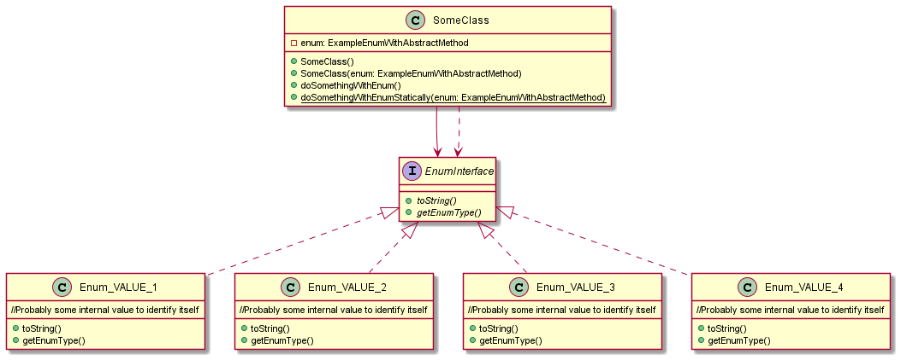
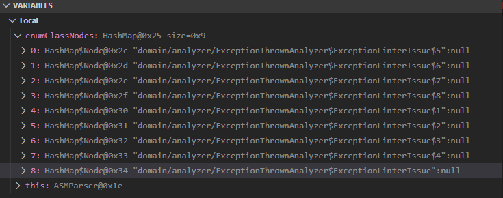

# From the Archives - Reasoning about Linter Design

This is a blogified form of the design journals I wrote for [DesignLint](https://github.com/FaceFTW/DesignLint), a Java Linter project I worked on with others for the Software Design and Software Construction and Evolution (aka. Software Refactoring) courses at Rose-Hulman as a student. The content here mainly talks about designing specific lints and some other design decisions made related to designing the actual framework and linter application. Compared to my teammates, I chose to structure my journal by features I worked on rather than what I did each day since it was easier to understand what I'm doing over the span of a few days rather than singular days.

This can be viewed on the project wiki along with the other design journals of my group members on the project repository [here](https://github.com/FaceFTW/DesignLint/wiki/%5BARCHIVE%5D-Old-Journal-Entries). I've also taken the liberty to indicate places where link rot or other missing resources occur.

__Additional NOTE: While I strive to be accurate with these blog posts, I have chosed to not correct any specific errors in content in this post. This is a preservation decision and also a laziness decision.__

__*NOTE: Use of information in this post or the associated project code should be cited properly. Failure to do so would be considered plagarism in (primarily) academic contexts. I do not condone cheating or academic dishonesty.*__

---

## 2/2/22 - 2/8/22 (Architecture Specification)

This is an aggregate entry that discusses most of the design decisions decided (in conjunction with other group members) as well as other relevant planning details

### Problems Addressed

The goal is to define a generalized architecture for project modules, features the project will support, and other planning/organization details. This will allow for parallel development of features while ensuring easy integration after testing each feature. This will also outline which features that I will focus on and what features this journal will document (along with architecture implementation).

### Architecture Design

Generally speaking, the group has decided to follow the Three Layers Principle for our architecture, therefore splitting it into three different layers: presentation, domain, and data source. While our project will not be heavily focused in presentation layer code (given that it will be interacted with using command-line parameters), this separation from the domain will give flexibility should we choose to add or change how the user interacts with the linter (such as a GUI or interactive console application). Another important justification is to ensure that should any way we use functionality from the ASM library, it should be resistant to massive code changes should the library itself change. This is done at the data source layer by providing a single class serving like an "adapter" between the library and our codebase (but not like the design pattern for modules), therefore any changes that ASM makes to do a certain task only requires changing the "adapter" in our codebase rather than all instance of that task.

The following UML Diagram was generated to illustrate the general architecture of the linter and its features (this is the most recent revision as of 2/8/22):

> Whoops, this was a Discord Image that is now lost to time. Hindsight is 20/20 I guess

Generally speaking, this is a very rough diagram, especiall with specifics of the `ASMParser` class. This is intentional as functionality that we need to pull from ASM will be implemented on a "per-need" basis, therefore minimizing unused code. All linter features will be some form of a `DomainAnalyzer`, which is invoked by the template method `getFeedback(String[] classList)`. Generally speaking, the idea is that all features of the project will follow these general steps to perform their desired functionality:

```java
public final ReturnType getFeedback(String[] classList){

    this.getRelevantData(classList);                //Abstract method
    this.analyzeData()                              //Abstract Method
    ReturnType retType = this.composeReturnType()   //Abstract Method

    //Hook calls are intentionally excluded, that is a placeholder
    //in case we find the need for one
    return retType;
}
```

This fits the general problem that a template pattern tries to solve: a common set of steps where each step may execute differently. The presentation layer (whatever implemenation it ends up with) will interact with `DomainAnalyzer` classes via `ReturnType` objects that contain the results that a linter feature will return. `ReturnType` is a presentation layer data strucutre in the sense that semantically speaking, domain layer code should not talk directly to the presentaion layer, rather presentation talks to domain (by Three Layers principle definition).

It should be noted `ASMParser` also is more of a stub-like description in this UML diagram as detailed needs for each feature will likely vary. The only solid detail is that the classes passed throught the linter will only be parsed once, and then "cached" in the `ASMParser` object for future calls. The general understanding is that parsing is an expensive operation, therefore this will minimize time the linter takes on larger scoped programs. Presentation layer details are also stubbed in the `PresentationHandler` class, this way the application can be interacted with as an API without refactoring the functionality from a `main()` call. At the moment, the focus will be getting some features implemented before working on getting the linter to run multiple features at once, but this architecture by rough design should be modular such that other features could be tacked on with minimal effort.

### Feature Selection

Aside from the architecture design choices, I have chosen to implement the following linter features:

- Throwing Generic Exceptions (Style Check)
- High Class Coupling (Principle Violation)
- Strategy Pattern (Design Pattern Detection)

These are defined as issues `#4 (link rot)`, `#6 (link rot)`, and `#11 (link rot)` on the issue board. All features will undergo test-driven development, therefore test cases and example classes that the linter should handle will be developed before the actual linter itself. Commits that make progress to any of these features will tag them in the commit message as Github will automatically add those commits to that issue thread.

## 2/9/22-2/10/22

### Problems Addressed

This entry will focus on implementing the Throwing Generic Exception style check (referenced by `#6 (link rot)`). This will include the general strategies for approaching this feature as well as some relevant implementation details on how this feature works in an efficient and maintainable manner.

### About this Style Violation

Technically speaking, this style violation is based on two different code smells defined by the [Common Weakness Enumeration (CWE) Database](https://cwe.mitre.org/index.html): [CWE-396](https://cwe.mitre.org/data/definitions/396.html) and [CWE-397](https://cwe.mitre.org/data/definitions/397.html). [SonarSource](https://rules.sonarsource.com/java/type/Code%20Smell), a company that creates industry-standard linters, includes the specific CWE instances amd examples of non-compliant code that will be used for the purpose of designing the tests for this feature.

#### CWE-396

[CWE-396](https://cwe.mitre.org/data/definitions/396.html) is the identification for the "Declaration of Catch of Generic Exception", with the reasoning for this being a weakness is "catching overly broad exceptions promotes complex error handling code that is more likely to contain security vulnerabilities". This weakness is applicable to C++, C#, and Java, but we will only use this CWE definition in the Java context. SonarSource provides the following examples for non-compliant and compliant code ([Source](https://rules.sonarsource.com/java/type/Code%20Smell/RSPEC-2221)):

Non-Compliant Code:

```java
try {
  // do something that might throw an UnsupportedDataTypeException or UnsupportedEncodingException
} catch (Exception e) { // Noncompliant
  // log exception ...
}
```

Compliant Code:

```java
try {
  // do something
} catch (UnsupportedEncodingException|UnsupportedDataTypeException|RuntimeException e) {
  // log exception ...
}


//If RuntimeException should not be caught
try {
  // do something
} catch (UnsupportedEncodingException|UnsupportedDataTypeException e) {
  // log exception ...
}
```

Given that catch clauses allow you to define multiple types of exceptions that should be caught, this justifies why this would be a style violation. Details about how we can determine if a generic exception is caught will be discussed after introducing CWE-397 (the next section).

#### CWE-397

[CWE-397](https://cwe.mitre.org/data/definitions/397.html) is the CWE ID for the "Declaration of Throws for Generic Exception" weakness, with a similar line of reasoning as CWE-396 for classifying it as a weakness: "Throwing overly broad exceptions promotes complex error handling code that is more likely to contain security vulnerabilities." [SonarSource](https://rules.sonarsource.com/java/type/Code%20Smell/RSPEC-112) actually classifies this as a "major" code smell and also includes `RuntimeException`, the `Throwable` interface, and `Error` instances as non-compliant with this rule. They also note that "Generic exceptions in the signatures of overriding methods are ignored, because overriding method has to follow signature of the throw declaration of the superclass," therefore this issue can be present in different in cases where inheritance is applicable. For all intensive purposes, we will detect all instances where a generic exception is thrown regardless if by superclass or concrete definition. SonarSource provides the following non-compliant and compliant code examples (Source hyperling already in paragraph):

Non-Compliant Code:

```java
public void foo(String bar) throws Throwable {  // Noncompliant
  throw new RuntimeException("My Message");     // Noncompliant
}
```

Compliant Code:

```java
public void foo(String bar) {
  throw new MyOwnRuntimeException("My Message");
}
```

Again, the same reasoning for justifying CWE-396 as a weakness applies here as well: Why not make specific exceptions (or use one already defined by Java) than throwing multiple types of exceptions. To illustrate how both of these weakness will be checked, we discuss how exceptions work in Java bytecode in the next section.

### Java Bytecode Exceptions

Given we are using the [ASM library](https://asm.ow2.io/) for parsing Java bytecode (which is the compiled form of Java source code), the manual will have more details about how it can find exceptions (aside from reading the [Java VM specification](https://docs.oracle.com/javase/specs/jvms/se8/jvms8.pdf) which is **_dense_**). &sect;3.1.4 of the [ASM User Guide](https://asm.ow2.io/asm4-guide.pdf) (titled Exception Handlers) notes the following:

> There is no bytecode instruction to catch exceptions: instead the bytecode of a method is associated with a list of exception handlers that specify the code that must be executed when an exception is thrown in a given part of a method. An exception handler is similar to a try catch block: it has a range, which is a sequence of instructions that corresponds to the content of the try block, and a handler, which corresponds to the content of the catch block. The range is specified by a start and end labels, and the handler with a start label. For example the source code below:
>
> ```java
> public static void sleep(long d) {
>     try {
>         Thread.sleep(d);
>     } catch (InterruptedException e) {
>         e.printStackTrace();
>     }
> }
> ```
>
> can be compiled into:
>
> ```java
> TRYCATCHBLOCK try catch catch java/lang/InterruptedException
>     try:
>         LLOAD 0
>         INVOKESTATIC java/lang/Thread sleep (J)V
>         RETURN
>     catch:
>         INVOKEVIRTUAL java/lang/InterruptedException printStackTrace ()V
>         RETURN
> ```
>
> The code between the try and catch labels corresponds to the try block, while the code after the catch label corresponds to the catch block. The TRYCATCHBLOCK line specifies an exception handler that covers the range between the try and catch labels, with a handler starting at the catch label, and for exceptions whose class is a subclass of InterruptedException. This means that if such an exception is thrown anywhere between try and catch the stack is cleared, the exception is pushed on this empty stack, and execution continues at catch.

This answers how we determine what types of exceptions are caught, but it doesn't answer how to determine exceptions _thrown_. Obviously, we cannot read the original source code with the method signature that declares a throw declaration, but likely the code should contain a reference to some call that represents throwing an exception.

Actually, we don't need to even look at the code to find an invocation of a method that "throws" exceptions (this mechanism of the VM seems complicated in the first place). The [Java VM Specification](https://docs.oracle.com/javase/specs/jvms/se8/jvms8.pdf) actually gives us a nice hint here in &sect;4.7 - the `CLASS` file format, more specifically &sect;4.7.9.1 - Signatures. When describing method signatures, the specification describes the following:

> A _method signature_ encodes type information about a (possibly generic) method declaration. It describes any type parameters of the method; the (possibly parameterized) types of any formal parameters; the (possibly parameterized) return type, if any; and the types of any exceptions declared in the method's `throws` clause.
>
> &nbsp;&nbsp;_MethodSignature_:
> &nbsp;&nbsp;&nbsp;&nbsp; _[TypeParameters]_ ( _{JavaTypeSignature}_ ) _Result_ _{ThrowsSignature}_
>
> &nbsp;_Result_:
> &nbsp;&nbsp;&nbsp;&nbsp;_JavaTypeSignature_ > &nbsp;&nbsp;&nbsp;&nbsp;_VoidDescriptor_
>
> &nbsp;&nbsp;_ThrowsSignature_:
> &nbsp;&nbsp;&nbsp;&nbsp;^ ClassTypeSignature
> &nbsp;&nbsp;&nbsp;&nbsp;^ TypeVariableSignature

Looking at the [ASM User Guide](https://asm.ow2.io/asm4-guide.pdf) again, we can confirm this finding under &sect;7.1.1 as follows:

> The ASM tree API for generating and transforming methods is based on the `MethodNode` class (see Figure 7.1).
>
> ```java
>     public class MethodNode ... {
>     public int access;
>     public String name;
>     public String desc;
>     public String signature;
>     public List<String> exceptions;               ///We Want This
>     public List<AnnotationNode> visibleAnnotations;
>     public List<AnnotationNode> invisibleAnnotations;
>     public List<Attribute> attrs;
>     public Object annotationDefault;
>     public List<AnnotationNode>[] visibleParameterAnnotations;
>     public List<AnnotationNode>[] invisibleParameterAnnotations;
>     public InsnList instructions;
>     public List<TryCatchBlockNode> tryCatchBlocks; ///We also want this
>     public List<LocalVariableNode> localVariables;
>     public int maxStack;
>     public int maxLocals;
> }
> ```

This is great! ASM already does the work needed to separate throws declarations from the signature for us. Although we need a bit more digging to understand what the `TryCatchBlockNode` contains and what we need from it. Looking at the [Javadocs for ASM](https://asm.ow2.io/javadoc/index.html), The description of the `exceptions` field in `MethodNode` contains "the internal names of the method's exception classes". We can also see that `TryCatchBlockNode` has a `type` string that contains "the internal name of the type of exceptions handled by the handler", therefore we can base our functionality around finding these fields in a method for each class.

### Implementation and Test Methodology

While the analyzer is going to be implemented as a `DomainAnalyzer` in the context of the architecture, there needs to be a way to test the singluar unit of exception analysis against various cases. Moreover, I've generated the following cases that should either be compliant or non-compliant with the linter's rules:



In practice, these method names are really excessive, but they effectively describe what each example is supposed to represent. Overall, there are 7 types of speicific violations that this linter will support, which are defined in an enum of`ExceptionThrownAnalyzer.java`:

- `THROW_EXCEPTION`: Declares a throw of `java.lang.Exception`
- `THROW_RUNTIMEEXCEPTION`: Declares a throw of `java.lang.RuntimeException`
- `THROW_ERROR`: Declares a throw of `java.lang.Error`
- `THROW_THROWABLE`: Declares a throw of `java.lang.Throwable`
- `CATCH_EXCEPTION`: Has a try-catch block that catches `java.lang.Exception`
- `CATCH_RUNTIMEEXCEPTION`: Has a try-catch block that catches `java.lang.RuntimeException`
- `CATCH_THROWABLE`: Has a try-catch block that catches `java.lang.Throwable` (not commonly seen, but valid to compile)

_It should be noted that `java.lang.Error` by the JVM specification and design are terminating, therefore cannot be caught_

The examples are not completely exhaustive, but do account for cases where both a throw declaration and a try-catch block of a method violate the linter's rules. More specifically, `THROW_` violations are checked first, then `CATCH_` violations. While testing can be done by checking the output of the `composeReturnType()`, it seems more reasonable to separate the actual linter rules into its own method for further testing, which I have done by creating `checkMethodCompliance()`. This returns a list of `ExceptionStyleIssue` enums that are then used by `composeReturnType()` to dynamically generate output using some `String.format` with a constant format specified in the class declaration. In fact, this separation of linter functionality makes the [analysis section of the analyzer](https://github.com/rhit-csse374/202220-Project-TeamS4G2/blob/13ca1cfe65e58bce2040d144f12d1a6ac094e688/src/domain/ExceptionThrownAnalyzer.java?plain=1#L69-80) rather simplistic.

Overall, I see this as a flexible design given that supporting other exceptions (such as checking for `java.io.IOException`) is a simple as adding an enum and adding a case to `checkMethodCompliance()`. This also follows the template method set by the architecture's `DomainAnalyzer` and also does not pull from ASM directly by using `ASMParser` as a "adapter" (not a design pattern adatper).

## 2/13/22-2/15/22

### Problems Adressed

The focus of this entry is about the implementation and design of the High Coupling principle violation linter `#4 (link rot)`. Similar to the structure of the previous entry, this will discuss strategies attacking this problem and relevant implementation details.

### Defining Class Coupling

Class coupling by definition is pretty straightforward: the more dependendent a class is on other classes to function, the higher coupling that class has. However, there are a couple of intrinsics and other details about defining a dependency to consider. In [Microsoft's .NET Documentation on the topic](https://docs.microsoft.com/en-us/visualstudio/code-quality/code-metrics-class-coupling?view=vs-2022), "class coupling 'measures the coupling to unique classes through parameters, local variables, return types, method calls, generic or template instantiations, base classes, interface implementations, fields defined on external types, and attribute decoration.'" While Java 8 (the baseline target version of Java used by the linter) doesn't use all of the types of structure and features that C# (or .NET by extension) uses, we can still use the following in our analysis of class coupling:

- Parameters
- Local Variables
- Return Types
- Method Calls
- Generic/~~Template~~ Instantiations (Template doesn't really exist in Java)
- Interface Implementations,
- Base Classes (Kinda weird to define in Java, but included anyway)

Another thing to consider is what type of unique classes to include in the coupling count. A good reason for this consideration is because the use of fundamental classes (such as those defining primitive classes) could inflate those numbers to indicate that the class or module is less maintainable than it actually is. [Visual Studio's Code Metrics](https://docs.microsoft.com/en-us/visualstudio/code-quality/code-metrics-class-coupling?view=vs-2022) doesn't include C# primitive types such as `string`, `int`, `boolean`, however it does count those provided by the .NET framework.



Here is an example of some code metrics against my (admittedly overkill) implementation of the original Shopping Cart homework assignment (which was written as a microservice API in C#). Visual Studio 2022 evaluates the entire project to have a class coupling of 75, with the the `StoreController` being the class with the highest coupling of 43. Initially, seeing these numbers and knowing the base definition of class coupling, it was pretty shocking and I even documented this in that assignment's engineering notebook, but I investigated to ensure that I was actually writing good software. In fact the answer was pretty transparent when looking at the class coupling count for the fields in `StoreController`: you can see that `HttpClient` and `_dbContext` each have a class coupling of one. While I expect the `ApiDbContext` object `_dbContext` to increase the class coupling inherently by being in the design, `HttpClient` is part of the ASP.NET framework yet is still counted by the code metrics. Furthermore, you can notice that the `_badDiscountCounter` which is of type `Dictionary<string,int>` only has a class coupling of one, given that the generic type parameters are both primitive.

With this example in mind, the question now becomes "what is classified as high coupling?" and "is it bad to be higly coupled on a solid framework such as .NET or the Java API?" The [.NET Maintainability Rule CA1506](https://docs.microsoft.com/en-us/dotnet/fundamentals/code-analysis/quality-rules/ca1506) is the rule for avoiding excessive coupling, which specifies the default coupling threshold as 95 for types and 40 for methods. This seems a bit high overall for every case (such as projects using many external libraries), but justified for certain cases. The [aforementioned Visual Studio documentation article about code metrics](https://docs.microsoft.com/en-us/visualstudio/code-quality/code-metrics-class-coupling?view=vs-2022) cites an external study that has specified "an upper-limit value of 9 is the most efficient" in predicting software failure. This case seems too low for programs that rely purely on foundational APIs or serve as foundation pieces for a large-scale architecture. So should we make this conditional based on the classes, or choose one option over the other?

I reference .NET and Visual Studio's code metrics not just because C# is quite similar to Java (at least in basic form), but also because .NET is a _massive_ framework by itself. There is so much more functionality that .NET 6 (or C# 9 for that matter) supports and implements for developers that it may make sense for them to rely primarily on .NET for verious structures or algorithms rather than reimplementing it themselves. This shouldn't always be a justification for highly-coupled projects, but may explain .NET's higher numbers compared to that of Java 8. Therefore, I think there needs to be a slight refocusing under a Java context, rather than refer to .NET for this linter...

### Class Coupling - A Java Perspective

I'm going to employ mostly similar logic to how .NET treats code coupling to some degree given the similarity between Java and C# at their core. But more specifically, here are some of the rules the linter will enforce and the rationale behind it:

- The linter will consider a class to have high coupling if:

  - It is coupled to 9 or more classes that are not part of the Java Runtime (JRE)
  - It is coupled to 20 or more classes in total (including those from the JRE)
    - Classes that the linter will consider to be part of the JRE are those within the `java.*`, `com.sun.*`, and `sun.*` packages. Classes in the Java Extensions (`javax.*`) and JDK classes (`jdk.*`) are excluded given that the former is not longer included in default installations of the JRE since Java 11 and the latter requires the JDK which is a separate download from the JRE.

> _The idea behind this number has to do with some of the basic principles of good OOP design, mainly about the responsibilities and object has and how it should interact with other objects. I mark a separation between the counts for JRE classes given that (for the context of Java 8 at least), is unlikely to change and less susceptible to risk. However, unlike .NET which contains many more foundational classes, Java's Runtime Framework isn't as large or in-depth, and is much simpler in action than some of .NET's features. The exclusions of the JDK and Java Extensions classes, which are likely to change and have (as mentioned above) more accurately determine how much a class relies on the core portion of the JRE. However, just because you pull alot of functionality from a low-risk functionality does not mean that you shouldn't consider if your object is doing too much._
>
> _Also, references to libraries are considered to be project code, even if the library is often maintained in such a way that minimizes risk of change (see Apache and their slew of Java libraries). There is no efficient way for me to determine how "stable" a library's functionality is in regards to how likely features are added and removed without complications that could break the linter in practice. Even though 9 coupled classes seems low when considering a project that uses libraries, it is also a good architectural practice to provide an "interface"-like layer between external libraries and any codebase. Applying this practice effectively reduces the coupling of a class to a specific library to 1, which is the lowest amount of coupling any class can have for containing any non-primitive object. Therefore, this low-ish limit seems reasonable._

- Coupling will be determined on:
  - Field Types
  - Method Parameters
  - Method Returns
  - Objects created in Methods
  - Static Calls in Methods
- Fields/Objects that are based on an interface type but have an explicit instance in code that instantiates it to a concrete implementation will count both the interface and concrete class as coupled to the analyzed class.
- `java.lang.String` and static classes representing primitive types (such as `java.lang.Double`) are counted in coupling because they are still not primitive types.
- Generic Type Parameters will not count toward class coupling

> _This doesn't really change too much about what is analyzed, save generic type parameters. This decision mainly revolves around the fact that Wildcard and polymorphic type parameters exist (such as `<T? implements Comparable>` which is often seen) in Java (and other languages), but resolving these can be confusing. Also, ASM seems to remove data about Generic fields and I don't feel like using reflection to figure it out myself (seems to be a Java thing however from a quick google search, taking with grains of salt). I acknowledge that classes using generics/parameterized typing receive additional coupling based on what the parameters are, but for the scope of this assignment, I think that this is a reasonable exception on excluding a part of a feature. I cover most of the sources of coupling (especially with the method related instances), therefore still being a relatively accurate analysis of a class's coupling._
>
> _The second bullet point is a distinction I want to make explicit because there is a general reason for this rule. Consider the following stub class with the following method:_
>
> ```java
> public class CouplingExample{
>     private List<String> exampleInterfaceField;
>
>     public CouplingExample(){
>        this.exampleInterfaceField = new ArrayList<>();
>     }
> }
> ```
>
> _Excluding the constructor, this example has a base class coupling of 2 which come from `java.util.List` and `java.lang.String`. However, the constructor introduces a new class (`java.util.ArrayList`) that the VM needs to fetch in order to run this class becuase it needs to know how to construct an `ArrayList`. Even if this example class's functionality fundamentally relied on the responsibilites defined by `List` and used polymorphism, the coupling to `ArrayList` still exists because of this call. Therefore, I felt that making this rule explicit was necessary as nitpicky as it may seem._

### Test and Implementation Methodology

Similar to the exception linter, I use a very similar method of thinking in generating test cases and how it is implemented in the linter. While the pieces of functionality are a bit more "disjointed" compared to the previous linter, this still follows the general template set by `DomainAnalyzer`. In this case, test cases will evaluate if the linter is able to test the following cases and how it should respond to each type of input it finds (_NOTE - PC stands for Project Coupling and TC stands for Total Coupling_):

| Class Name                            | Class Type                              | PC Violation | TC Violation | Throws Warning? |
|---------------------------------------|-----------------------------------------|--------------|--------------|-----------------|
| `ZeroCouplingDataStruct`              | Data Structure                          | N            | N            | N               |
| `ZeroCouplingObject`                  | Object                                  | N            | N            | N               |
| `ZeroCouplingStaticClass`             | Static Methods Only                     | N            | N            | N               |
| `LowCouplingDataStruct`               | Data Structure                          | N            | N            | N               |
| `LowCouplingDataStruct2`              | Data Structure                          | N            | N            | N               |
| `LowCouplingObject`                   | Object                                  | N            | N            | N               |
| `LowCouplingStaticClass`              | Static Methods Only                     | N            | N            | N               |
| `HighCouplingDataStructProjectCount`  | Data Structure                          | Y            | N            | Y               |
| `HighCouplingObjectProjectCount`      | Object                                  | Y            | N            | Y               |
| `HighCouplingStaticClassProjectCount` | Static Methods Only                     | Y            | N            | Y               |
| `HighCouplingDataStructTotalCount`    | Data Structure                          | N            | Y            | Y               |
| `HighCouplingObjectTotalCount`        | Object                                  | N            | Y            | Y               |
| `HighCouplingStaticClassTotalCount`   | Static Methods Only                     | N            | Y            | Y               |
| `HighCouplingNightmareClass`          | Any Design Enthusiast's Worst nightmare | Y            | Y            | Y               |

Obviously, the low and high coupling variants of the classes will introduce coupling in various different ways, but otherwise these examples are (for all intensive purposes) exhhaustive. For the actual implementation, we rely on a couple of methods that will be defined in the `HighCouplingAnalyzer`:

```java
    public List<String> countClassCoupling(String className)
    public int determineJavaCoupling(String[] coupled)
```

Basically, `countClassCoupling()` is the intial call in the `runAnalyzer()` template method for actually determining all the possible coupling each class has. We can then get more information by getting the number of JRE classes by running `determineJavaCoupling()`, which as a result we can be a _bit_ more specific in our error messages if the class is excessively coupled in general or to project resources (its funny because I'm probably using a bit for that purpose). It should be noted that if both project and total coupling are found to be excessive, the linter returns a total coupling error (think of total coupling as a larger issue that may contain project coupling in some cases). This separation allows me to separately test and implement the actual counting functionality before writing the analyzer check (which quite literally is just some number comparisons) and output generation.

While the functionality of this linter is somewhat limited by Java language and VM conventions (from my understanding), it is still extensible nonetheless. The `determineJavaCoupling()` method (if desired) could be altered to add support for incorporating other "stable" libraries (such as Apache as mentioned prior) by adding another Regex check to the method, everything else remains practically unchanged. Verbosity can also be added to output relatively easily as the actual mehtod that determines the coupling of a class is separate from the template set by `DomainAnalyzer`. This is yet another solid design that integrates with our architecture well by following the template method pattern and being developed by test cases first rather than solid implementation. (You can check the edit dates for this quite literally, I barely implemented anything except the `determineJavaCoupling()` when I finished this entry).

### Addendum

The purpose of this section is to add some extra implementation and testing changes I have made since the writing of this entry as they are significant enough in explaining functionality:

#### Some New Counting Rules

While writing the implementation for extracting all classes used in the method bodies of classes, I noticed that the constructor (which is named `<init>()` internally in all class bytecode) by default will always have an entry to `java/lang/Object`. This is expected and in fact, _all_ non-primitive types will extend `java/lang/Object`. This should be a fundamental exception because the JVM will always load `java/lang/Object`, even with a single class containing the `static void main()` for entering execution. Therefore, I introduce the following rule:

- `java.lang.Object` is excluded from all coupling counts

Another new rule is about self-dependency, which was also discovered during implementation and works on a relatively similar argument albeit actually less complicated: If a class depends on itself, it is a circular dependency, which is paradoxical. Most objects will rely on themselves when executing thier own methods or accessing their own fields, therefore this warrants another rule to more accurately display actual class dependency:

- Classes do not count themselves in coupling

#### New Test Cases Related to Interfaces

When determing the whole `java.lang.Object` issue, I realized that there were no adequate cases for both testing the coupling of classes to interfaces/abstract classes and the coupling of an interface to other interfaces/classes. I've added the following example classes (and associated test cases) to account for testing this functionality.

- `CouplingInterfaceExample`
- `CoupledToInterfaceExample`

## 2-15-22 - A Brief Interlude About Presentation Layer

### Problems Solved

This entry is a brief discussion on how the presentation layer was constructed, especially in respect to the issue of loading classes to lint and how we handle output.

### The Classpath Problem

One of the issues with the base testing implementation of our linters (and the example one provided) is that it assumes all class files are in the classpath of the VM. Similar to the `PATH` environment variable for operating systems to determine where to find executables, the classpath of the Java VM is the analog for determining the file system locations of where the VM can possibly find `.class` files to dynamically load. By default, the classpath includes the base Java Runtime (JRE) with relevant Java Extensions (if installed), and the directory of the bootstrap class ([Source](https://docs.oracle.com/javase/tutorial/essential/environment/paths.html)). This setting is not recursive (but can be if a wildcard is introduced). JAR Files(Java ARchives), which are equivalent to a consolidated archive of `.class` files are treated differently from both directories and `.class` files, but for the purpose of this exercise I will assume the parser will only look at `.class` files and not parse JARs.

There are many ways to remedy this, such as adding the `-cp` argument to the Java VM arguments (this is different from the ones that would be placed in `args[]` of `main()`), forcing the user to move all classes they want to parse into the same folder as the compiled application, or even prompting the user dynamically for the list of all files they want to parse. However, many of these solutions pose problems, but I have found one that would post the least issues for the user:

- The frontend can take in multiple path arguments to either `.class` files or directories
  - Paths can be relative (from the command line working directory) or absolute
  - If a directory path is specified, then the linter will process all `.class` files it finds in that directory and all subdirectories (implicit `recurse` option)
    - This means that a user could simply extract the contents of many JAR files to a single folder and enter that folder's path as an argument, and the linter will determine all of the necessary class files to parse.
    - Symbolic Links will be ignored to prevent recursion issues

### The Presentation Layer

Below is an updated class diagram focused mainly on the presentation layer and the prominent parts of the domain layer. The data source layer is noted but not fully elaborated as it is not entirely relevant to how the presentation layer functions.



Overall it is a very light facade-like design that follows many of the principles of the Three Layers architecture. However, I chose a separation between the presentation layer and a bootstrap class because of the following reasons:

- The presentation layer is responsible for giving the domain (and data source by proxy) the resources it needs from user input, and then write that ouput to some channel. While our application is purely command-line in design, the `vomitOutput()` method allows anyone using the linter as a library (save the bootstrap) to choose where they actually want the output to go. `LinterMain` when it calls `presentationLayer.vomitOutput()` will specify `System.out`, which is the default PrintStream for console output, but any bootstrap can specify any `PrintStream` they want output to be written to.
  - I should mention that the only reason why the presentation layer's output method is called `vomitOutput()` was because I was feeling a bit nauseous while writing this code. Could have been from the caffeine or the vertigo of checking my directory recursion, could be either.
- The presentation layer only expects a list of absolute paths to `.class` files. The argument here is that this allows the bootstrap to more carefully limit or dictate what files are actually linted because it can control what list of files that the presentation layer receives. For example, if a different bootstrap using this as a library had a feature for ignoring files in certain directories, the boostrap can check the files it finds before actually sending it to the presentation layer.

I didn't write unit testing for the presentation layer, but I have actually run and validated the output it produces in proxy. This layer is not the primary focus of the project, and given its simple functionality it doesn't fully warrant that much depth of testing.

## 2/16/22 - 2/17/22: Strategy Detection

### Problems Solved

This entry discusses the ideas on how I plan to implement the final feature I have chosen for this linter, the Strategy Pattern detector. Again, this will follow the same structure as the previous entries to give a general thought process as well as relevant testing and implementaiton details.

### Defining the Strategy Pattern

THe primary purpose of the strategy is to allow for a class to select algorithms dynamically at runtime based on some concrete stategy object implementing a strategy interface.

|  |
|:----------------------------------------------:|

The above UML class diagram depicts a very simple strategy pattern with two possible concrete versions of the abstract `strategyMethod()` that is called in `SomeObject`'s `doSomethingUsingStrategy()`. The strategy for SomeObject is determined upon construction and composes the strategy as a field that is typed by `StrategyType`. Therefore by polymorphism, because all concrete methods implement `StrategyType`, `SomeObject` will always be able to execute `strategy.strategyMethod()` due to this constraint required for implementing an interface.

However, strategy pattern can be used multiple times, whether it be the same or different types of strategies. Consider the following class diagrams:

|  |  |
|:-------------------------------------------:|:-----------------------------------------------:|

Both UML diagrams demonstrate a strategy pattern inherently, but the left diagram composes different types of strategies and the right diagram composes multiple of the same types of strategies. These properties are not mutually exclusive, therefore we should probably split the search of the necessary information as follows:

- Find an Inteface that is implemented by concrete classes. These interfaces will be the **_strategy types_** that a class is composed of.
  - Abstract classes cannot be a strategy in the sense that this pattern is purely based on _behavior_, not structure of objects (such as Adapter or Facade)
- The classes implemening a strategy interface will be **_strategies_** of that strategy type.
  - These classes must implement a single specific strategy interface, and _no other strategy interfaces_ This restriction is to ensure that actual strategies are encapsulated for a specific strategy type, regardless of the context.
- All classes that has fields (or composes themselves with) objects of a strategy type interface are considered to be **_using ths strategy type_**
  - Additional rule: If a class declares any field where it is typed as a concrete class (aka. strategy) and not as a strategy type interface (aka. strategy type), the linter will throw an error noting the class that violates this rule. Strategy pattern only works because the interface defines the behavior that all classes implementing it must define, therefore using the direct class will only define how that specific class operates.

This seems pretty robust for determining what is a strategy pattern, except there are a couple of edge cases I would like to consider.

#### Static Method Strategies

Suppose we have the following UML Class diagram:



Given that this is a `final` class, there are couple of interesting attributes that it will exhibit. The private constructor and static instatiation by the VM means that it is not good practice to let such an object have fields, thus this practice is done for utility classes that have methods that should not be overidden. In order for any method in this class to run, they are `static`ly declared and therfore must operate based on the parameter inputs it receives. But the question now becomes if the method _uses a `StrategyType` object_ as one of its parameters (among others), is that still implementing the strategy pattern?

I assert that while not always used (and alternative implementations acheiving the same goal exist), this still is a strategy pattern based on its purpose: to encapsulate algorithms in classes. In the examples above, the strategy pattern is encapsulated in some `StrategyType` field(s) that composes the using object, but in cases where algorithms are operating in static instances, the encapsulation occurs in the `StrategyType` parameter declaration. Therefore, I add another rule with some strict conditions.

- If a class is `final` and has at least one `static` method declared with a parameter typed as a strategy type, that class is also considered to be **_using that strategy type_**

#### Enums (yes, enums)

Enums are very interesting in Java given they can effectively operate as classes. Consider the following enum:



If you notice the abstract override of `toString()` in `ExampleEnumWithAbstractMethod`, this is actually allowed, but required every value in the enum to implement its own version. But now the question becomes how does Java compiles this? Well, it does it similar to this:



Java won't use the exact naming scheme, but it definitely complies it this way. In fact it seems all enums are compiled this way. In the `ExceptionThownAnalyzer`, I created the following enum within the `ExceptionThrownAnalyzer` class:

```java
	public enum ExceptionLinterIssue {
		NO_VIOLATION {
			@Override
			public String getErrorString() {
				return "does not contain any violations";
			}
		},
		THROW_EXCEPTION {
			@Override
			public String getErrorString() {
				return "throws java.lang.Exception in its method signature instead of a specific exception class";

			}
		},
		CATCH_EXCEPTION {
			@Override
			public String getErrorString() {
				return "has at least one catch block that catches java.lang.Exception instead of a specific exception class";
			}
		},
		THROW_RUNTIME_EXCEPTION {
			@Override
			public String getErrorString() {
				return "throws java.lang.RuntimeException in its method signature instead of a specific exception class";
			}
		},
		CATCH_RUNTIME_EXCEPTION {
			@Override
			public String getErrorString() {
				return "has at least one catch block that catches java.lang.RuntimeException instead of a specific exception class";
			}
		},
		THROW_ERROR {
			@Override
			public String getErrorString() {
				return "throws java.lang.Error in its method signature instead of a specific exception class";
			}
		},
		// CATCH_ERROR, --May not be possible, I *think* Errors actually crash the VM
		THROW_THROWABLE {
			@Override
			public String getErrorString() {
				return "throws java.lang.Throwable in its method signature instead of a specific exception class";
			}
		},
		CATCH_THROWABLE {
			@Override
			public String getErrorString() {
				return "has at least one catch block that catches java.lang.Throwable instead of a specific exception class";
			}
		}; // Usually not common practice AFAIK, still placing it just in case

		public abstract String getErrorString();

	}
```

I ran it through ASM and analyzed the debug results, leaving me with pretty good confirmation of how I suspect it works:



While not explicitly clear just from the list unless you analyze the `ClassNode` objects, the only base class (i.e. the only class without `$#` append) does have both the `ACC_ENUM` (`0x4000`) and `ACC_INTERFACE` (`0x0400`) access flags, while the others have only the `ACC_ENUM` flag, therefore indicating this is all related to the enum. Even the declared methods in the interface class have the `ACC_ABSTRACT` access flag, therefore recreating the exact pattern structure.

However, not all enums are compiled this way. Enums can also have concrete method, which means that enum can no longer be compiled as an interface as per the [JVM Specification](https://docs.oracle.com/javase/specs/jvms/se8/jvms8.pdf)

> Methods of interfaces may have any of the flags in Table 4.6-A set except `ACC_PROTECTED`, `ACC_FINAL`, `ACC_SYNCHRONIZED`, and `ACC_NATIVE` (JLS §9.4). In a class file whose version number is less than 52.0, each method of an interface must have its `ACC_PUBLIC` and `ACC_ABSTRACT` flags set; in a class file whose version number is 52.0 or above, each method of an interface must have exactly one of its `ACC_PUBLIC` and `ACC_PRIVATE` flags set.

Enums that contain non-final non-staic fields are also likely not compiled this way as per the [JVM Specification](https://docs.oracle.com/javase/specs/jvms/se8/jvms8.pdf)

> Fields of interfaces must have their `ACC_PUBLIC`, `ACC_STATIC`, and `ACC_FINAL` flags set; they may have their `ACC_SYNTHETIC` flag set and must not have any of the other flags in Table 4.5-A set (JLS §9.3).

While it is possible to check for all of these constraints when reading enums, this may unnecessarily increase the complexity of the analyzer, especially with determining output. Therefore, I add the following restriction:

- All enum classes and interfaces (i.e. Classes or Interface with the `ACC_ENUM` flag) are ignored by the analyzer.

### Testing and Methodology

There are the two main types of tests

- Identifying Strategy Type Interfaces and Strategy Classes
- Class Compliance using Strategy Patterns

For the first feature, I create the following classes which (as described by their name) should determine the expected behavior of the analyzer:

- `CompliantStrategyTypeA`
  - `CompliantStrategyA1`
  - `CompliantStrategyA2`
  - `NonCompliantStrategyA3ImplementsOtherInterfaces`
  - `NonCompliantStrategyA4Subclass`
- `CompliantStrategyTypeB`
  - `CompliantStrategyB1`
  - `CompliantStrategyB2`
  - `CompliantStrategyB3`
  - `NonCompliantStrategyB3ImplementsOtherStrategyInterface`
- `WarningStrategyTypeCNoStrategies`

For the second feature, the following example classes are implemented

- `CompliantClassUsingStrategyA`
- `CompliantclassUsingStrategyB`
- `CompliantClassUsingMultipleSingleStrategy`
- `CompliantClassUsingDifferentSingleStrategy`
- `CompliantAbstractClassUsingSomeStrategy`
- `CompliantFinalClassUsingStrategyWithMethods`
- `NonCompliantClassUsingConcreteStrategy`

As done in the previous analyzers, I will be checking each functionality of the linter in steps:

- `SweepInterfaces()`
  - Gets all of the potential interfaces and all implementing classes of those interfaces
- `LintInterfaceList()`
  - Finds and removes any interfaces/classes that violate any linter rules, these are added as linter errors
- `GetUsingClasses()`
  - Gets all classes that reference a StrategyType
- `GetBadUsingClasses()`
  - Gets all classes that reference a concrete strategy class

Generally speaking, this analyzer will be semantically more complicated to implement, therefore I feel the reduction in scope to exclude was warranted overall.
