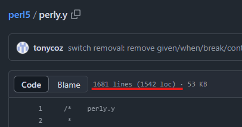
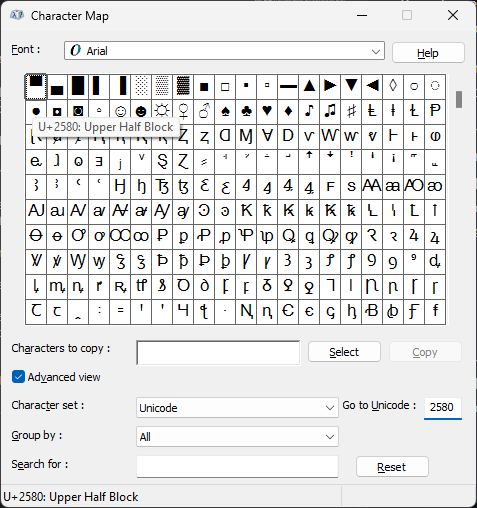

# Talking Cows, Perls, and Terminals
### A really obscure rabbit hole to recreate an old piece of software

I've been working on a project called [shell-toy](https://github.com/FaceFTW/shell-toy) that intends to replace the `cowsay | fortune` calls my shell init scripts make. Aside from performance improvements, I also added work to inline the actual "cows" and "fortunes" in the executables to make them easily transferrable across machines. Those features are not the main focus of this post, and you can always take a look at the code for yourself.

The main focus is about reading the Perl files and rendering them properly in terminals.

This is a long post because you would not believe the amount of things one has to do to make drawings in terminals look good (not even artistically speaking). Not all posts on `ref_cycle` are going to be like this but as the first "official" post I think it deserves to be long.

- [Talking Cows, Perls, and Terminals](#talking-cows-perls-and-terminals)
		- [A really obscure rabbit hole to recreate an old piece of software](#a-really-obscure-rabbit-hole-to-recreate-an-old-piece-of-software)
	- [What is Cowsay Actually?](#what-is-cowsay-actually)
	- [The Rabbit Hole of Perl Syntax Parsing](#the-rabbit-hole-of-perl-syntax-parsing)
	- [What is a Cow?](#what-is-a-cow)
	- [Escape Hatches (But Not Really)](#escape-hatches-but-not-really)
	- [Implementing a Talking Cow](#implementing-a-talking-cow)
		- [`impl` Part 1 - Lexing Cows](#impl-part-1---lexing-cows)


## What is Cowsay Actually?

Ironically, `cowsay` is actually just a Perl script. Originally written and maintained by [Tony Monroe](https://web.archive.org/web/20120225123719/http://www.nog.net/~tony/warez/cowsay.shtml) until it was transferred to [GitHub](https://github.com/cowsay-org/cowsay), its gained a couple of new features or so, but otherwise remained simple at its core.

`cowsay` is quite a unique niche in the developer/sysadmin world, you might see it on [r/unixporn](reddit.com/r/unixporn) or someone's shell startup as a nice little flair. Projects such as [pokemonsay](https://github.com/possatti/pokemonsay) have created a way to generate sprites from official renders but still use `cowsay` underneath.

I use it because it makes me feel cool.

## The Rabbit Hole of Perl Syntax Parsing

Whenever you want to describe a programming language syntax, it is often done in [Backus-Naur Form (or BNF)](https://en.wikipedia.org/wiki/Backus%E2%80%93Naur_form). It's a way of describing syntax in a form of "grammar" similar to a programming language (wow very meta!). The IEEE uses an augmented form of this called [Augmented Backus-Naur Form (ABNF)](https://en.wikipedia.org/wiki/Augmented_Backus%E2%80%93Naur_form) to describe protocol structure and messaging, and they can be drawn into nice little diagrams.

However, BNF/ABNF is a very "literal" definition, and it can be a pain to write. The [Rust Reference](https://doc.rust-lang.org/stable/reference/introduction.html) uses a much more looser method by defining a more specific and concise grammar. I'd rather not have to write and verify BNF (especially since I'm a bit rusty with that), so I'm going to follow their examples.

---

Since Cowsay is written in Perl and cow files are just perl scripts, I could start by writing a parser for Perl scripts, use that output as an "intermediate representation" (IR), then convert the IR to a string that the terminal will use. So let's do a quick google search...


Uh-oh.

Following some links around and here is what the [official Perl FAQ](https://perldoc.perl.org/perlfaq7) has to say on the matter:

> #### Can I get a BNF/yacc/RE for the Perl language?
> There is no BNF, but you can paw your way through the yacc grammar in perly.y in the source distribution if you're particularly brave. The grammar relies on very smart tokenizing code, so be prepared to venture into toke.c as well.
>
> In the words of Chaim Frenkel: "Perl's grammar can not be reduced to BNF. The work of parsing perl is distributed between yacc, the lexer, smoke and mirrors."

_Uh-oh._

There was a reference to the [yacc (or GNU Bison)](https://www.gnu.org/software/bison/) definitions for Perl to potentially use as a starting point above, which can be derived into some BNF that can be used. Ok, *surely* the [grammar](https://github.com/Perl/perl5/blob/blead/perly.y) isn't that bad...



Yeah, I'm not reading all of that.

Before trying and go the hard route, let's think about this real quick:
- Perl has no formally defined BNF because the grammar is _not context-free_. The grammar can change depending on what was parsed before it and what is currently being parsed, making it more difficult to define a stable grammar.
- While there is a "base" source of grammar, it requires me to learn `yacc` and (in all honesty) I don't feel like learning all of that just for a "simple" project like this.

Maybe it's a good idea to inspect this problem from a different angle...

## What is a Cow?

Not philosophically or metaphorically. More like what is a "cow file".

I mentioned earlier that Cowsay defines the cow drawing in separate "cow files". These end with the aptly named `.cow` extension and some come pre-installed with the `cowsay` package (in the distribution/manager of your choice). Let's take a look at what the "default" cow file contains:

```perl
$the_cow = <<"EOC";
        $thoughts   ^__^
         $thoughts  ($eyes)\\_______
            (__)\\       )\\/\\
             $tongue ||----w |
                ||     ||
EOC
```
There is quite a bit of information from this that is useful:
- Most of the Cow data is an interpolated string defined in a variable called `$the_cow`. It seems like the syntax `<<"EOC"` indicates that after the the line, the variable's declaration doesn't end until the token in quotes (`EOC`) is reached.
- Because this is an interpolated string, there are placeholder variables (`$thoughts`, `$eyes`, `$tongue`) that are likely replaced by the main script based on options passed to it (i.e. `cowthink` changes the shape of the bubble and the `$thought` lines). It can be assumed these placeholders have "fixed" values.

This is great! Surely this means this project is simple and not complicated at all right! But my very expensive piece of paper (aka my Bachelor's Degree in Software Engineering) tells me that a single use case is never enough. Luckily, other developers like to create cows, and have created ways to convert images into nice little pixel art displayed in the terminal, such as this [website by charc0al on GitHub](https://charc0al.github.io/cowsay-files/converter/). Here is one such example from that website:

```perl
# Gordon Freeman w/ gravity gun (Half Life 2)
# by unknown - http://www.minecraftpixelarttemplates.com/2013/09/gordon-freeman-half-life.html
# Generated with Charc0al's cowsay file creator http://charc0al.github.io/cowsay-files/converter

$x = "\e[49m  ";          #reset color
$t = "$thoughts ";
$a = "\e[48;5;235m  ";
$b = "\e[48;5;94m  ";
$c = "\e[48;5;223m  ";
$d = "\e[48;5;231m  ";
$e = "\e[48;5;242m  ";
$f = "\e[48;5;88m  ";
$g = "\e[48;5;251m  ";
$h = "\e[48;5;208m  ";
$i = "\e[48;5;251m  ";
$j = "\e[48;5;186m  ";

$the_cow = <<EOC
      $t
        $t
          $t      $a          $x
            $t  $a$b          $a$x
              $a$b              $a$x
              $a$b$c  $b  $c$b$c$a$x
              $a$b$c            $a$x
###################
# Cut for brevity
###################
        $a$e        $a$x    $a$e        $a$x
        $a            $x    $a            $x
EOC
```

Ok this is fine, most of the notes currently still hold up, just need to add some more things to keep in mind:
- Comments start with `#` in these scripts
- You can create variable definitions and reference them with interpolation in `$the_cow`. Some elaboration on that:
  - The name of the variable is prefixed with `$`. I will make some inferred rules about names to make work easier further down the line and restrict them to only contain alphanumeric characters.
  - The value of the variable is specified on the right hand side (RHS) of the `=`, and is an interpolated string surrounded in double-quotes and terminated afterward with a semi-colon. Because it is interpolated, _any data that would be considered valid cow data here can be placed in the _.
  - Throughout the remainder of this post, I will be referring to this as a _**binding**_ for a variable, based on the idea of [free and bound variables](https://en.wikipedia.org/wiki/Free_variables_and_bound_variables). It will become more clear why I use this terminology later
- Only while parsing the interpolated string, variable bindings can be referenced just by using `$<name>` in the string.
  - An assumption will be made that `$thoughts`, `$eyes`, and `$tongue` are "reserved" like a type of keyword.

An important observation tangentially related to the one above is the value of the variable bindings: they are all `\e` escapes that have a common pattern. Before I start to break that down, let's look at one more example.

Remember in the introduction I mentioned [`pokemonsay`](https://github.com/possatti/pokemonsay), well under the hood it uses a program called [`img2xterm`](https://github.com/rossy/img2xterm) to convert the sprites into terminal strings. It even has a mode for directly creating cow files. Let's take a look at some of the outputs generated:

```perl
# this draws a pikachu
binmode STDOUT, ":utf8"; # this will be treated as a "comment" by us
$the_cow =<<EOC;
           $thoughts
            $thoughts
             $thoughts
              $thoughts
\e[49m  \e[38;5;236m\N{U+2584}\N{U+2584}         \e[48;5;236m \e[38;5;239m\N{U+2584}\e[49m\e[38;5;236m\N{U+2584}
\N{U+2584}\e[48;5;236m\e[38;5;178m\N{U+2584}\e[48;5;178m \e[48;5;221m\N{U+2584}\e[48;5;237m\e[38;5;220m\N{U+2584}\e[49m\e[38;5;236m\N{U+2584}\N{U+2584}\N{U+2584}\N{U+2584}    \e[48;5;236m \e[48;5;239m\e[38;5;142m\N{U+2584}\e[48;5;237m\N{U+2584}\e[49m\e[38;5;236m\N{U+2584}
\e[38;5;237m\N{U+2580}\e[48;5;142m\N{U+2584}\e[48;5;178m\e[38;5;142m\N{U+2584}  \e[48;5;221m\e[38;5;178m\N{U+2584}\e[48;5;239m\e[38;5;142m\N{U+2584}  \e[48;5;236m\e[38;5;221m\N{U+2584}\e[48;5;237m\N{U+2584}\e[49m\e[38;5;237m\N{U+2584} \N{U+2580}\e[48;5;101m\e[38;5;236m\N{U+2584}\e[48;5;142m\e[38;5;178m\N{U+2584}\e[48;5;236m \e[49m\e[38;5;237m\N{U+2584}
  \N{U+2580}\e[48;5;142m\N{U+2584}\e[48;5;178m\e[38;5;142m\N{U+2584}  \e[48;5;142m\e[38;5;178m\N{U+2584}\e[48;5;239m\e[38;5;142m\N{U+2584}\e[48;5;221m\e[38;5;239m\N{U+2584}\e[38;5;220m\N{U+2584} \e[48;5;236m\e[38;5;137m\N{U+2584}\e[38;5;220m\N{U+2584}\e[48;5;221m\N{U+2584}  \e[48;5;178m\e[38;5;221m\N{U+2584}\e[48;5;237m\N{U+2584}\e[49m\e[38;5;236m\N{U+2584}
   \N{U+2584}\e[48;5;236m\e[38;5;178m\N{U+2584}\e[48;5;178m \e[38;5;142m\N{U+2584}\e[48;5;142m\e[38;5;237m\N{U+2584}\e[49m\e[38;5;236m\N{U+2580}\e[48;5;236m \e[48;5;137m\e[38;5;221m\N{U+2584}\e[48;5;221m \e[38;5;220m\N{U+2584}\e[38;5;236m\N{U+2584}\e[48;5;178m\e[38;5;231m\N{U+2584}\e[48;5;220m\e[38;5;178m\N{U+2584}\e[48;5;221m  \e[38;5;220m\N{U+2584}\e[48;5;237m\e[38;5;221m\N{U+2584}\e[49m\e[38;5;236m\N{U+2584}
   \e[38;5;237m\N{U+2580}\e[48;5;142m\N{U+2584} \e[48;5;237m\e[38;5;142m\N{U+2584}\e[49m\e[38;5;236m\N{U+2584}\e[48;5;236m\e[38;5;220m\N{U+2584}\e[48;5;221m  \e[48;5;220m\e[38;5;221m\N{U+2584}\e[48;5;221m\e[38;5;203m\N{U+2584}\e[48;5;239m\N{U+2584}\e[48;5;236m\e[38;5;221m\N{U+2584}\e[48;5;221m \e[38;5;220m\N{U+2584}\N{U+2584}\e[48;5;137m\e[38;5;221m\N{U+2584}\e[48;5;221m\e[38;5;236m\N{U+2584}\e[49m\e[38;5;237m\N{U+2580}
    \e[38;5;236m\N{U+2584}\e[48;5;236m\e[38;5;131m\N{U+2584}\e[48;5;131m\e[38;5;239m\N{U+2584}\e[48;5;240m\e[38;5;220m\N{U+2584}\e[48;5;136m\e[38;5;221m\N{U+2584}\e[48;5;221m\e[38;5;220m\N{U+2584}  \e[48;5;203m\e[38;5;239m\N{U+2584}\e[38;5;221m\N{U+2584}\e[48;5;220m \e[48;5;221m\e[38;5;178m\N{U+2584}\e[38;5;142m\N{U+2584}\e[48;5;142m\e[38;5;236m\N{U+2584}\e[48;5;239m\N{U+2584}\e[48;5;136m\e[38;5;237m\N{U+2584}\e[49m\N{U+2580}
     \e[38;5;236m\N{U+2580}\e[48;5;239m\N{U+2584}\e[48;5;136m\e[38;5;221m\N{U+2584}\e[48;5;221m  \e[48;5;239m\N{U+2584}\e[48;5;221m\e[38;5;240m\N{U+2584}\N{U+2584}\e[48;5;239m\e[38;5;220m\N{U+2584}\e[48;5;178m \e[48;5;142m \e[48;5;236m\e[38;5;237m\N{U+2584}\e[49m
      \e[38;5;236m\N{U+2580}\e[48;5;239m\e[38;5;237m\N{U+2584}\e[48;5;221m    \e[38;5;236m\N{U+2584}\e[48;5;142m\N{U+2584}\e[38;5;237m\N{U+2584}\e[49m\N{U+2580}
        \N{U+2580}\e[48;5;221m\e[38;5;236m\N{U+2584}\e[48;5;236m\e[38;5;237m\N{U+2584}\e[49m\N{U+2580}\e[39m

EOC
```

Woah, that is radically different from the other examples. One of the core observations is that _there is no reliance on interpolation except for the `$thoughts` declarations_. The string is just a series of [escape sequences](https://en.wikipedia.org/wiki/Escape_sequence) and spaces, which means it's time to jump down a second rabbit hole before the core of the project can be started.

## Escape Hatches (But Not Really)

I'm not as versed in the history of old computer terminals and their designs; Being born 20+ years after their introduction doesn't help with that. But I can at least talk about [terminal emulation](https://en.wikipedia.org/wiki/Terminal_emulator) which is what all those funny `\e` and `\N` things represent.

Basically,

___TODO___ Add filler description

Like before, let's find a good reference for all the commands. And sure enough someone on the internet created this [nice cheat sheet](https://gist.github.com/ConnerWill/d4b6c776b509add763e17f9f113fd25b) with a good chunk of resources. Here is a brief summary of the information needed to begin implementation:

- `\e[` indicates the start of the "escape sequence" and simulates `ESC` key presses on the old consoles.
  - There are multiple ways to enumerate color sequences, but they will have a pattern that will terminate with `m` (for some reason beyond my knowledge)
  - ANSI colors are simple numeric codes for colors, each corresponding to setting the foreground or background of the cell. _This does change the state of the terminal because subsequent characters will have the same styling_.
    - The current color can reset this with the special codes `39` and `49` for foreground and background respectively. This can be considered a special code.
    - There is also bright/dimmed colors; I am ignoring those for now since most of these cow files are generated without dimming in mind.
  - 8-bit colors (256-color) and 24-bit colors (aka Truecolor) are an expansion of the ANSI format, but there is extra data to indicate using the `38` and `48` like in the following sequences:
    - 8-bit (256-color): `\e[<38|48>;5;<8-bit-code>m`
    - 24-bit color (Truecolor): `\e[<38|48>;2;<8-bit-red>;<8-bit-green>;<8-bit-blue>m`

- `\N` is likely to represent a sequence of unicode characters by `xterm`. It can be confirmed by looking at a utility like the character map in Windows (below). It can also be asserted the pattern of this structure is `\N{U+XXXX}`, where X is the 4-digit hexadecimal code for the unicode character.
  - ANSI standard also allows for a pattern like `\uXXXX`, but I have yet to see consistent usage in the field.




There is now enough analysis of how a cow file is defined to move on to the next steps, [_**lexing**_](https://en.wikipedia.org/wiki/Lexical_analysis) and _**interpreting**_.

## Implementing a Talking Cow

Here is a rough implementation diagram of the interpreter. You'll notice it's much simpler compared to other interpreters and compilers because by cutting out noise like multi-file parsing and binary linkage:

```
                +----------+                +--------------+
                |          | Intermediate   |              |
                |  Lexer   | Representation |  Interpreter |
Cow File ------>|          +--------------->|              +----> Terminal Output
                |          |                |  - Internal  |
                |          |                |    State     |
                +----------+                +--------------+
```

### `impl` Part 1 - Lexing Cows

First, let's make it easier for us to operate on the cow file and do some [_lexical analysis (aka "lexing")_](https://en.wikipedia.org/wiki/Lexical_analysis). This will make it easier to generate the respective action in the interpreter based off of what got parsed.

In order to do that, an [_intermediate representation (IR)_](https://en.wikipedia.org/wiki/Intermediate_representation) is needed. It doesn't have to be anything sophisticated, it just has to be something that allows us to uniquely identify fragments in a meaningful way. It also don't need a sophisticated tree-like structure; In reality this IR is just a level of abstraction over "machine code" which is _imperative_ and just a list of commands; these are printing a character, changing the color of the terminal text, and some minor control flow.

Let's enumerate them as a Rust enum, which is actually really useful given it can encode special state in "variants" and

```rust
// latest version can be found here:
// https://github.com/FaceFTW/shell-toy/blob/main/src/parser.rs

pub enum TerminalCharacter {
    Space,
    DefaultForegroundColor,
    DefaultBackgroundColor,
    TerminalForegroundColor256(u8),
    TerminalForegroundColorTruecolor(u8, u8, u8),
    TerminalBackgroundColor256(u8),
    TerminalBackgroundColorTruecolor(u8, u8, u8),
    UnicodeCharacter(char),
    EscapedUnicodeCharacter(char),
    ThoughtPlaceholder,
    EyePlaceholder,
    TonguePlaceholder,
    Newline,
    Comment,
    VarBinding(String, Vec<TerminalCharacter>), //Think in terms of s-expr-like interpretation then this makes sense
    BoundVarCall(String),
    CowStart,
}
```

It's not very complicated, and it enumerates every "instruction" the parser will interpret as well as additional data that might be needed. I could simplify this some more but for writing parsing rules it makes it concise and clear. Speaking of which, let's talk about how to should get the source data into this format.

There is this very convenient Rust crate called [nom](https://github.com/rust-bakery/nom) that creates [_parser combinators_](https://en.wikipedia.org/wiki/Parser_combinator) which are very efficient. The idea here is to create smaller parser then use composition to create the full parser. For example, here is a rough diagram of the parsers created for this project:

```
                                                 +------------+
                                              +->| Spaces     |
                        +------------------+  |  +------------+
                    +-->| Spaces/NewLines  +--+  +------------+
                    |   +------------------+  +->| Newlines   |
                    |   +------------------+     +------------+
                    +-->| 8 Bit Colors     |
                    |   +------------------+
                    |   +------------------+
                    +-->| Truecolor        |
                    |   +------------------+
                    |   +------------------+
                    +-->| Comments/Junk    |
                    |   +------------------+
+----------------+  |   +------------------+
| Main Parser    +--+-->| Unicode Char     |     +------------+
+----------------+  |   +------------------+  +->| Var Name   |
                    |   +------------------+  |  +------------+
                    +-->| Var Binding      +--+  +------------+
                    |   +------------------+  +->| Var Value  |
                    |   +------------------+     +------------+
                    +-->| Var Reference    |
                    |   +------------------+
                    |   +------------------+
                    +-->| Placeholders     |
                    |   +------------------+
                    |   +------------------+
                    +-->| Start Marker     |
                        +------------------+

```

Each parser is a simple function that takes an input string, and returns data in the form of `IResult<I,O,E>`, effectively, the remaining unparsed input, the captured output, and optionally an error if it happens. It's a wrapper around the standard Rust `Result<T,E>` that I and others love, but the extra addition allows us to iterate through the input until it's been fully consumed (more on that later).

Here is an example for parsing the escaped unicode characters that was discussed earlier:
```rust
fn unicode_char<'a, E: ParseError<&'a str>>(i: &'a str) -> IResult<&'a str, TerminalCharacter, E> {
    alt((
        //Xterm -\\N{U+xxxx}
        map(
            delimited(tag("\\N{U+"), take(4 as usize), tag("}")),
            |code: &str| {
                TerminalCharacter::UnicodeCharacter(
                    char::from_u32(u32::from_str_radix(code, 16).unwrap()).unwrap(),
                )
            },
        ),
        //ANSI - \\uxxxx
        map(preceded(tag("\\u"), take(4 as usize)), |code: &str| {
            TerminalCharacter::UnicodeCharacter(
                char::from_u32(u32::from_str_radix(code, 16).unwrap()).unwrap(),
            )
        }),
    ))(i)
}
```

It's fairly readable, but here's a rundown:
- There are two parsers which look for different string patterns, which if it matches is passed through a function to put into IR that it just lexed/parsed a `UnicodeCharacter` with the respective character.
  - The first one looks for 4 characters that are surrounded by the starting "tag" (or sequence) `\N{U+` and the ending "tag" `}`. The `tag()` defines a parser function that looks for an explicit string, while the `take(n)` consumes the next `n` characters.
  - The second one also looks for 4 characters but that are prefixed by `\u`.
- The `alt((parser,parser,...))` method is how to do composition in a "branching" manner. It will try the parsers in the specified order and return the `IResult<I,O,E>` of the first successful parse, or the errors if none of the parsers were successful.

I'm not going to break down each and every parser; the [source code](https://github.com/FaceFTW/shell-toy/blob/main/src/parser.rs) is available for viewing to see other things like creating variable bindings (see the `var_binding()` function)