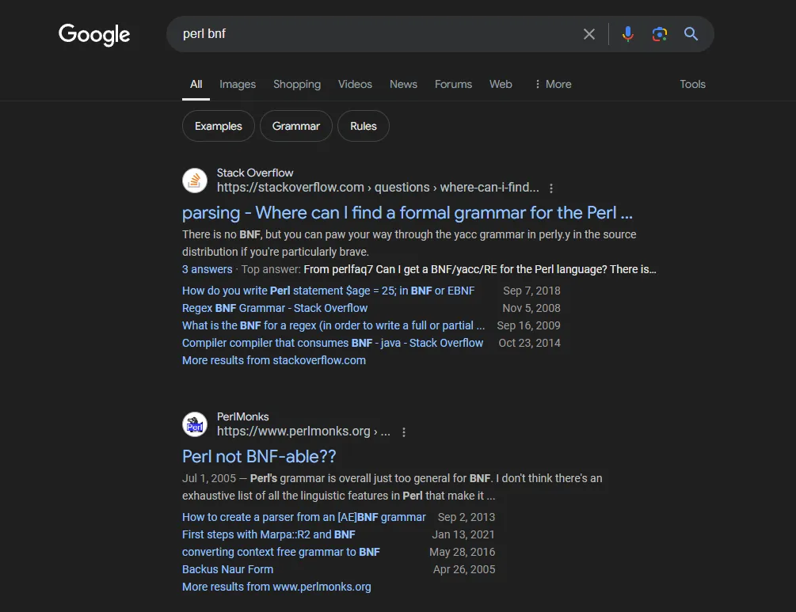
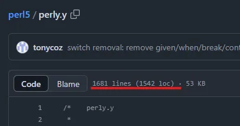
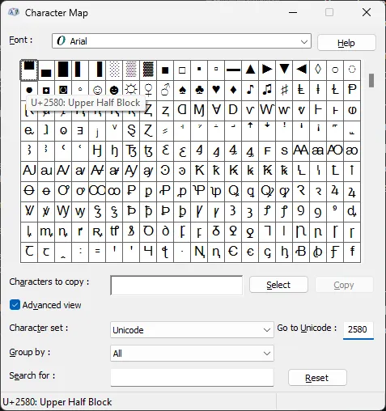
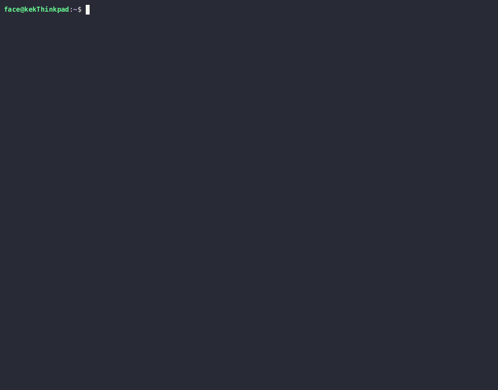
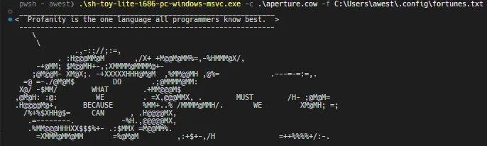
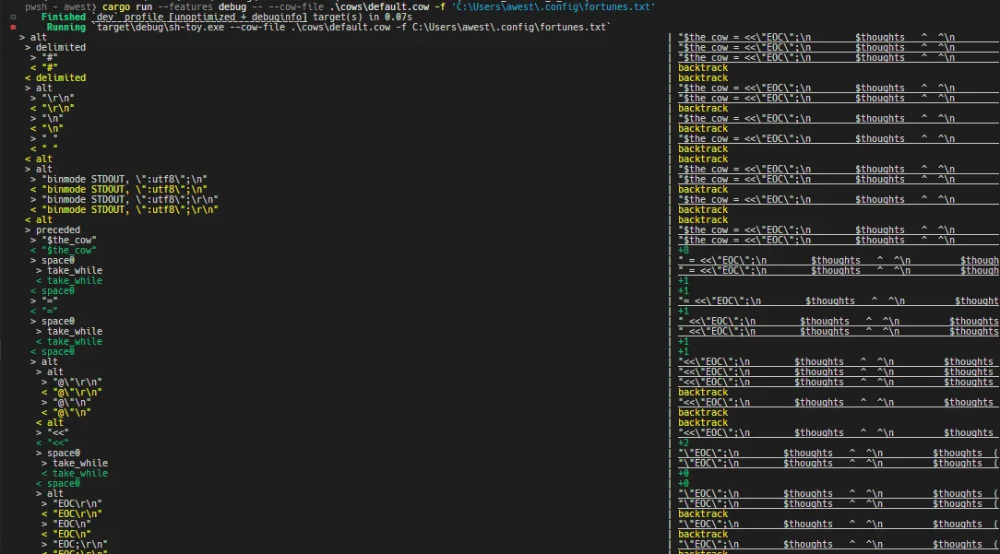

# Talking Cows, Perls, and Terminals
_A really obscure set of rabbit holes to recreate an old piece of software_

[***Jump to the Errata***](#errata)

I've been working on a project called [shell-toy](https://github.com/FaceFTW/shell-toy) that intends to replace the `fortune | cowsay` calls my shell init scripts make. Aside from performance improvements, I also added work to inline the actual "cows" and "fortunes" in the executables to make them easily transferrable across machines. Those features are not the main focus of this post, and the code is fully open source for anyone to take a peek.

The main focus is about reading the Perl files and rendering them properly in terminals.

This is a long post because of the amount of things one has to do to make drawings in terminals look good (not even artistically speaking). Not all posts on `ref_cycle` are going to be like this but as the first "official" post I think it deserves to be long.

## What is Cowsay Actually?

Ironically, `cowsay` is actually just a Perl script. Originally written and maintained by [Tony Monroe](https://web.archive.org/web/20120225123719/http://www.nog.net/~tony/warez/cowsay.shtml) until it was transferred to [GitHub](https://github.com/cowsay-org/cowsay), its gained a couple of new features or so, but otherwise remained simple at its core.

`cowsay` is quite a unique niche in the developer/sysadmin world, seen on [r/unixporn](reddit.com/r/unixporn) or someone's shell startup as a nice little flair. Projects such as [pokemonsay](https://github.com/possatti/pokemonsay) have created a way to generate sprites from official renders but still use `cowsay` underneath.

I use it because it makes me feel cool.

## The Rabbit Hole of Perl Syntax Parsing

When trying to describe a programming language syntax, it is often done in [Backus-Naur Form (or BNF)](https://en.wikipedia.org/wiki/Backus%E2%80%93Naur_form). It's a way of describing syntax in a form of "grammar" similar to a programming language (wow very meta!). The IEEE uses an augmented form of this called [Augmented Backus-Naur Form (ABNF)](https://en.wikipedia.org/wiki/Augmented_Backus%E2%80%93Naur_form) to describe protocol structure and messaging, and they can be drawn into nice little diagrams.

Since Cowsay is written in Perl and cow files are just Perl scripts, I could start by writing a parser for Perl scripts, use that output as an "intermediate representation" (IR), then convert the IR to a string that the terminal will use. So let's do a quick google search...


::: image

:::

Uh-oh.

Following some links around and here is what the [official Perl FAQ](https://perldoc.perl.org/perlfaq7) has to say on the matter:

> #### Can I get a BNF/yacc/RE for the Perl language?
> There is no BNF, but you can paw your way through the yacc grammar in perly.y in the source distribution if you're particularly brave. The grammar relies on very smart tokenizing code, so be prepared to venture into toke.c as well.
>
> In the words of Chaim Frenkel: "Perl's grammar can not be reduced to BNF. The work of parsing perl is distributed between yacc, the lexer, smoke and mirrors."

_Uh-oh._

There was a reference to the [yacc (or GNU Bison)](https://www.gnu.org/software/bison/) definitions for Perl to potentially use as a starting point above, which can be derived into some BNF that can be used. Ok, *surely* the [grammar](https://github.com/Perl/perl5/blob/blead/perly.y) isn't that bad...


:::image

:::

Yeah, I'm not reading all of that.

Before trying and go the hard route, let's think about this real quick:
- Perl has no formally defined BNF because the grammar is _not context-free_. The grammar can change depending on what was parsed before it and what is currently being parsed, making it more difficult to define a stable grammar.
- While there is a "base" source of grammar, it requires me to learn `yacc` and (in all honesty) I don't feel like learning all of that just for a "simple" project like this.

Maybe it's a good idea to inspect this problem from a different angle...

## What is a Cow?

Not philosophically or metaphorically. More like what is a "cow file".

I mentioned earlier that Cowsay defines the cow drawing in separate "cow files". These end with the aptly named `.cow` extension and some come pre-installed with the `cowsay` package (in the distribution/manager of your choice). Let's take a look at what the "default" cow file contains:

```perl
$the_cow = <<"EOC";
        $thoughts   ^__^
         $thoughts  ($eyes)\\_______
            (__)\\       )\\/\\
             $tongue ||----w |
                ||     ||
EOC
```
There is quite a bit of information from this that is useful:
- Most of the Cow data is an interpolated string defined in a variable called `$the_cow`. It seems like the syntax `<<"EOC"` indicates that after the line, the variable's declaration doesn't end until the token in quotes (`EOC`) is reached.
- Because this is an interpolated string, there are placeholder variables (`$thoughts`, `$eyes`, `$tongue`) that are likely replaced by the main script based on options passed to it (i.e. `cowthink` changes the shape of the bubble and the `$thought` lines). It can be assumed these placeholders have "fixed" values.

This is great! Surely this means this project is simple and not complicated at all right! But my very expensive piece of paper (aka my Bachelor's Degree in Software Engineering) tells me that a single use case is never enough. Luckily, other developers like to create cows, and have created ways to convert images into nice little pixel art displayed in the terminal, such as this [website by charc0al on GitHub](https://charc0al.github.io/cowsay-files/converter/). Here is one such example from that website:

```perl
# Gordon Freeman w/ gravity gun (Half Life 2)
# by unknown - http://www.minecraftpixelarttemplates.com/2013/09/gordon-freeman-half-life.html
# Generated with Charc0al's cowsay file creator http://charc0al.github.io/cowsay-files/converter

$x = "\e[49m  ";          #reset color
$t = "$thoughts ";
$a = "\e[48;5;235m  ";
$b = "\e[48;5;94m  ";
$c = "\e[48;5;223m  ";
$d = "\e[48;5;231m  ";
$e = "\e[48;5;242m  ";
$f = "\e[48;5;88m  ";
$g = "\e[48;5;251m  ";
$h = "\e[48;5;208m  ";
$i = "\e[48;5;251m  ";
$j = "\e[48;5;186m  ";

$the_cow = <<EOC
      $t
        $t
          $t      $a          $x
            $t  $a$b          $a$x
              $a$b              $a$x
              $a$b$c  $b  $c$b$c$a$x
              $a$b$c            $a$x
###################
# Cut for brevity
###################
        $a$e        $a$x    $a$e        $a$x
        $a            $x    $a            $x
EOC
```

Ok this is fine, most of the notes currently still hold up, just need to add some more things to keep in mind:
- Comments start with `#` in these scripts
- variable definitions can be created and referenced with interpolation in `$the_cow`. Some elaboration on that:
  - The name of the variable is prefixed with `$`. I will make some inferred rules about names to make work easier further down the line and restrict them to only contain alphanumeric characters.
  - The value of the variable is specified on the right-hand side (RHS) of the `=`, and is an interpolated string surrounded in double-quotes and terminated afterward with a semicolon. Because it is interpolated, _any data that would be considered valid cow data here can be placed in the _.
  - Throughout the remainder of this post, I will be referring to this as a _**binding**_ for a variable, based on the idea of [free and bound variables](https://en.wikipedia.org/wiki/Free_variables_and_bound_variables). It will become more clear why I use this terminology later
- Only while parsing the interpolated string, variable bindings can be referenced just by using `$<name>` in the string.
  - An assumption will be made that `$thoughts`, `$eyes`, and `$tongue` are "reserved" like a type of keyword.

An important observation tangentially related to the one above is the value of the variable bindings: they are all `\e` escapes that have a common pattern. Before I start to break that down, let's look at one more example.

Remember in the introduction I mentioned [`pokemonsay`](https://github.com/possatti/pokemonsay), well under the hood it uses a program called [`img2xterm`](https://github.com/rossy/img2xterm) to convert the sprites into terminal strings. It even has a mode for directly creating cow files. Let's take a look at some of the outputs generated:

```perl
# this would draw a pikachu but is modified to not break the markdown renderer of the blog
binmode STDOUT, ":utf8"; # this will be treated as a "comment" by us
$the_cow =<<EOC;
           $thoughts
            $thoughts
             $thoughts
              $thoughts
\e[49m  \e[38;5;236m\N{U+2584}\N{U+2584}         \e[48;5;236m
\e[38;5;239m\N{U+2584}\e[49m\e[38;5;236m\N{U+2584}
\N{U+2584}\e[48;5;236m\e[38;5;178m\N{U+2584}\e[48;5;178m
\e[48;5;221m\N{U+2584}\e[48;5;237m\e[38;5;220m\N{U+2584}\e[49m\e[38;5;236m\N{U+2584}\N{U+2584}
\N{U+2584}\N{U+2584}    \e[48;5;236m
\e[48;5;239m\e[38;5;142m\N{U+2584}\e[48;5;237m\N{U+2584}\e[49m\e[38;5;236m\N{U+2584}
\e[38;5;237m\N{U+2580}\e[48;5;142m\N{U+2584}\e[48;5;178m\e[38;5;142m\N{U+2584}
\e[48;5;221m\e[38;5;178m\N{U+2584}\e[48;5;239m\e[38;5;142m\N{U+2584}
\e[48;5;236m\e[38;5;221m\N{U+2584}\e[48;5;237m\N{U+2584}\e[49m\e[38;5;237m\N{U+2584}
\N{U+2580}\e[48;5;101m\e[38;5;236m\N{U+2584}\e[48;5;142m\e[38;5;178m\N{U+2584}\e[48;5;236m
\e[49m\e[38;5;237m\N{U+2584}
  \N{U+2580}\e[48;5;142m\N{U+2584}\e[48;5;178m\e[38;5;142m\N{U+2584}
  \e[48;5;142m\e[38;5;178m\N{U+2584}\e[48;5;239m\e[38;5;142m\N{U+2584}\e[48;5;221m\e[38;5;239m
  \N{U+2584}\e[38;5;220m\N{U+2584}
  \e[48;5;236m\e[38;5;137m\N{U+2584}\e[38;5;220m\N{U+2584}\e[48;5;221m\N{U+2584}
  \e[48;5;178m\e[38;5;221m\N{U+2584}\e[48;5;237m\N{U+2584}\e[49m\e[38;5;236m\N{U+2584}
   \N{U+2584}\e[48;5;236m\e[38;5;178m\N{U+2584}\e[48;5;178m
# Cut for brevity
        \N{U+2580}\e[48;5;221m\e[38;5;236m\N{U+2584}\e[48;5;236m\e[38;5;237m\N{U+2584}\e[49m
		\N{U+2580}\e[39m

EOC
```

Woah, that is radically different from the other examples. One of the core observations is that _there is no reliance on interpolation except for the `$thoughts` declarations_. The string is just a series of [escape sequences](https://en.wikipedia.org/wiki/Escape_sequence) and spaces, which means it's time to jump down a second rabbit hole before the core of the project can be started.

## Escape Hatches (But Not Really)

I'm not as versed in the history of old computer terminals and their designs; Being born 20+ years after their introduction doesn't help with that. But I can at least talk about [terminal emulation](https://en.wikipedia.org/wiki/Terminal_emulator) which is what all those funny `\e` and `\N` things represent.

Like before, let's find a good reference for all the commands. And sure enough someone on the internet created this [nice cheat sheet](https://gist.github.com/ConnerWill/d4b6c776b509add763e17f9f113fd25b) with a good chunk of resources. Here is a brief summary of the information needed to begin implementation:

- `\e[` indicates the start of the "escape sequence" and simulates `ESC` key presses on the old consoles.
  - There are multiple ways to enumerate color sequences, but they will have a pattern that will terminate with `m` (for some reason beyond my knowledge)
  - ANSI colors are simple numeric codes for colors, each corresponding to setting the foreground or background of the cell. _This does change the state of the terminal because subsequent characters will have the same styling_.
    - The current color can reset this with the special codes `39` and `49` for foreground and background respectively. This can be considered a special code.
    - There is also bright/dimmed colors; I am ignoring those for now since most of these cow files are generated without dimming in mind.
  - 8-bit colors (256-color) and 24-bit colors (aka Truecolor) are an expansion of the ANSI format, but there is extra data to indicate using the `38` and `48` like in the following sequences:
    - 8-bit (256-color): `\e[<38|48>;5;<8-bit-code>m`
    - 24-bit color (Truecolor): `\e[<38|48>;2;<8-bit-red>;<8-bit-green>;<8-bit-blue>m`

- `\N` is likely to represent a sequence of Unicode characters by `xterm`. It can be confirmed by looking at a utility like the character map on Windows (below). It can also be asserted the pattern of this structure is `\N{U+XXXX}`, where X is the 4-digit hexadecimal code for the Unicode character.
  - ANSI standard also allows for a pattern like `\uXXXX`, but I have yet to see consistent usage in the field.


:::image

:::

There is now enough analysis of how a cow file is defined to move on to the next steps, [_**lexing**_](https://en.wikipedia.org/wiki/Lexical_analysis) and _**interpreting**_.

## Implementing a Talking Cow

Here is a rough implementation diagram of the interpreter. It's much simpler compared to other interpreters and compilers because by cutting out noise like multi-file parsing and binary linkage:

```text
                +----------+                +--------------+
                |          | Intermediate   |              |
                |  Lexer   | Representation |  Interpreter |
Cow File ------>|          +--------------->|              +----> Terminal Output
                |          |                |  - Internal  |
                |          |                |    State     |
                +----------+                +--------------+
```

### `impl` Part 1 - Lexing Cows

First, let's make it easier for us to operate on the cow file and do some [_lexical analysis (aka "lexing")_](https://en.wikipedia.org/wiki/Lexical_analysis). This will make it easier to generate the respective action in the interpreter based off of what got parsed.

In order to do that, an [_intermediate representation (IR)_](https://en.wikipedia.org/wiki/Intermediate_representation) is needed. It doesn't have to be anything sophisticated, it just has to be something that allows us to uniquely identify fragments in a meaningful way. It also don't need a sophisticated tree-like structure; In reality this IR is just a level of abstraction over "machine code" which is _imperative_ and just a list of commands; these are printing a character, changing the color of the terminal text, and some minor control flow.

Let's enumerate them as a Rust enum, which is actually really useful given it can encode special state in "variants":

```rust
// latest version can be found here:
// https://github.com/FaceFTW/shell-toy/blob/main/src/parser.rs

pub enum TerminalCharacter {
    Space,
    DefaultForegroundColor,
    DefaultBackgroundColor,
    TerminalForegroundColor256(u8),
    TerminalForegroundColorTruecolor(u8, u8, u8),
    TerminalBackgroundColor256(u8),
    TerminalBackgroundColorTruecolor(u8, u8, u8),
    UnicodeCharacter(char),
    EscapedUnicodeCharacter(char),
    ThoughtPlaceholder,
    EyePlaceholder,
    TonguePlaceholder,
    Newline,
    Comment,
    VarBinding(String, Vec<TerminalCharacter>), //Think in terms of s-expr-like interpretation then this makes sense
    BoundVarCall(String),
    CowStart,
}
```

It's not very complicated, and it enumerates every "instruction" the parser will interpret as well as additional data that might be needed. I could simplify this some more but for writing parsing rules it makes it concise and clear. Speaking of which, let's talk about how to should get the source data into this format.

There is this very convenient Rust crate called [nom](https://github.com/rust-bakery/nom) that creates [_parser combinators_](https://en.wikipedia.org/wiki/Parser_combinator) which are very efficient. The idea here is to create smaller parser then use composition to create the full parser. For example, here is a rough diagram of the parsers created for this project:

```text
                                                 +------------+
                                              +->| Spaces     |
                        +------------------+  |  +------------+
                    +-->| Spaces/NewLines  +--+  +------------+
                    |   +------------------+  +->| Newlines   |
                    |   +------------------+     +------------+
                    +-->| 8 Bit Colors     |
                    |   +------------------+
                    |   +------------------+
                    +-->| Truecolor        |
                    |   +------------------+
                    |   +------------------+
                    +-->| Comments/Junk    |
                    |   +------------------+
+----------------+  |   +------------------+
| Main Parser    +--+-->| Unicode Char     |     +------------+
+----------------+  |   +------------------+  +->| Var Name   |
                    |   +------------------+  |  +------------+
                    +-->| Var Binding      +--+  +------------+
                    |   +------------------+  +->| Var Value  |
                    |   +------------------+     +------------+
                    +-->| Var Reference    |
                    |   +------------------+
                    |   +------------------+
                    +-->| Placeholders     |
                    |   +------------------+
                    |   +------------------+
                    +-->| Start Marker     |
                        +------------------+

```

Each parser is a simple function that takes an input string, and returns data in the form of `IResult<I,O,E>`, effectively, the remaining unparsed input, the captured output, and optionally an error if it happens. It's a wrapper around the standard Rust `Result<T,E>` that I and others love, but the extra addition allows us to iterate through the input until it's been fully consumed (more on that later).

Here is an example for parsing the escaped Unicode characters that was discussed earlier:
```rust
fn unicode_char<'a, E: ParseError<&'a str>>(i: &'a str) -> IResult<&'a str, TerminalCharacter, E> {
    alt((
        //Xterm -\\N{U+xxxx}
        map(
            delimited(tag("\\N{U+"), take(4 as usize), tag("}")),
            |code: &str| {
                TerminalCharacter::UnicodeCharacter(
                    char::from_u32(u32::from_str_radix(code, 16).unwrap()).unwrap(),
                )
            },
        ),
        //ANSI - \\uxxxx
        map(preceded(tag("\\u"), take(4 as usize)), |code: &str| {
            TerminalCharacter::UnicodeCharacter(
                char::from_u32(u32::from_str_radix(code, 16).unwrap()).unwrap(),
            )
        }),
    ))(i)
}
```

It's fairly readable, but here's a rundown:
- There are two parsers which look for different string patterns, which, if it matches is passed through a function to put into IR that it just lexed/parsed a `UnicodeCharacter` with the respective character.
  - The first one looks for 4 characters that are surrounded by the starting "tag" (or sequence) `\N{U+` and the ending "tag" `}`. The `tag()` defines a parser function that looks for an explicit string, while the `take(n)` consumes the next `n` characters.
  - The second one also looks for 4 characters, but that are prefixed by `\u`.
- The `alt((parser,parser,...))` method is how to do composition in a "branching" manner. It will try the parsers in the specified order and return the `IResult<I,O,E>` of the first successful parse, or the errors if none of the parsers were successful.

I'm not going to break down each and every parser; the [source code](https://github.com/FaceFTW/shell-toy/blob/main/src/parser.rs) is available for viewing to see other things like creating variable bindings (see the `var_binding()` function). The one thing I do want to show is the benefits of using parser combinators:

```rust
pub fn cow_parser(input: &str) -> IResult<&str, TerminalCharacter> {
    alt((
        comments,
        perl_junk,
        placeholders,
        var_binding,
        bound_var_call,
        spaces_and_lines,
        misc_escapes,
        colors_256,
        truecolor,
        unicode_char,
        escaped_char,
        map(take(1 as usize), |c: &str| {
            //TODO I don't like this
            TerminalCharacter::UnicodeCharacter(c.chars().into_iter().next().unwrap())
        }),
    ))(input)
}
```

I love how easy and clear it makes this entire process; There are clear, identifiable rules and there is no giant `if/else` tree to traverse to find a bug. During development when there was something wrong it was easy to tell if it was a lexer or interpreter issue because if it was the lexer, I can identify the bad parser and fix it. No hours of debugging, just 10–15 minutes. Beautiful.

So now an IR exists and the means to create it, but it is time to create the second part of the puzzle: interpretation.

### `impl` Part 2: Interpreting Cow "Speak"

Well, not actual cow language, but that's beyond the point.

First, it is important to discuss how the parser should be implemented; it's honestly trivial given Rust's `match` statements which allow easy and safe identification of the various IR forms defined in the lexer. Here is some rough pseudocode of what the interpreter function looks like:

```rust
fn interpreter(
    parsed_chars: &[TerminalCharacter],
) -> String {
    let mut cow_string = String::new();
    for term_char in parsed_chars {
        match term_char {
            TerminalCharacter::<variant> => {
                //Generate respective output OR update internal state
            }
            //...
        }
    }

    cow_string
}
```

I mentioned something about updating internal state. This part is a bit complicated; I'm being vague here because it's not all the kind of information that a traditional compiler/interpreter might store; there isn't any information about defined types, functions, or scoping here. Let's do a recap some of the observations made earlier that would require "state" when looking at the cow files:

- It is possible change the color of text in the terminal, and _it persists after triggering_.
- It is possible to have variable bindings that can be referenced in interpolated strings*

Let's break down these into respective problems

#### (Saving the) Environment
When I took a class on functional programming and learned Scheme/Racket (shout-out to Buffalo), I made my own Scheme-like interpreter in Racket (though it was really done in a Chez Scheme like environment, that's beside the point). Like any interpreter, the idea of how to store/reference variables (and closures for that matter) was an important topic; The solution for variables in Scheme (the key thing that needs to be stored) was a tree-like data structure called an ["environment"](https://docs.scheme.org/schintro/schintro_121.html). Luckily, there is no need for the recursive level because I am going to impose a restriction on variable values that _there is no recursive level references_. This means the following would not parse and intentionally throw an error:
```perl
$a = "test";
$b = "test$a"; #This fails in the interpreter
```

Looking at the IR definitions, variable bindings have two "data pieces": a `String` (the name) and a `Vec<TerminalCharacter>` (the value of the variable). If the interpreter identifies a variable binding, it can just _"register the binding"_ in its internal state. I represent this as a `HashMap<String,Vec<TerminalCharacter>>` like below:

```rust
//Inside interpreter function
let mut environment: HashMap<String, Vec<TerminalCharacter>> = HashMap::new();

// Inside match statement(this will make sense later)
TerminalCharacter::VarBinding(name, val) => {
    environment.insert(name.to_string(), val.to_vec());
}

//Also inside match statement
//Since binding values are stored as IR, do a recursive parse
//keep this in mind with the next section
TerminalCharacter::BoundVarCall(binding) => {
    let binding_val = environment
        .get(binding)
        .expect("Could not find a binding with the specified name");
    cow_string =
        cow_string + interpreter(&binding_val).as_str();
}
```

That is one problem solved, let's get to the next one.

#### Coloring the World

Adding color to terminal text isn't hard, there are many crates that provide that functionality. I personally chose [`owo_colors`](https://docs.rs/owo-colors/latest/owo_colors/) in this case, which provides a `Style` struct that can be applied to string types. So surely just adding a mutable `Style` to the interpreter state is fine:

```rust
//inside interpreter body:
let mut current_style= owo_colors::Style::new().default_color().on_default_color();

//Inside Match statement:
TerminalCharacter::Space => {
    cow_string = cow_string + format!("{}", " ".style(current_style.inner)).as_str()
}
TerminalCharacter::DefaultForegroundColor => current_style = current_style.default_color(),
TerminalCharacter::DefaultBackgroundColor => current_style = current_style.on_default_color(),
TerminalCharacter::TerminalForegroundColor256(color) => {
    current_style = current_style.color(XtermColors::from(*color))
}
TerminalCharacter::TerminalForegroundColorTruecolor(red, green, blue) => {
    current_style current_style.truecolor(*red, *green, *blue)
}
TerminalCharacter::TerminalBackgroundColor256(color) => {
    current_style = current_style.on_color(XtermColors::from(*color))
}
TerminalCharacter::TerminalBackgroundColorTruecolor(red, green, blue) => {
    current_style = current_style.on_truecolor(*red, *green, *blue);
}
TerminalCharacter::UnicodeCharacter(uchar) => {
    cow_string = cow_string + format!("{}", uchar.style(current_style.inner)).as_str()
}
//...
```
But now there is a bug at the variable reference interpretation code:
```rust
TerminalCharacter::BoundVarCall(binding) => {
    let binding_val = environment
        .get(binding)
        .expect("Could not find a binding with the specified name");
    cow_string =
        cow_string + interpreter(&binding_val).as_str();
}
```
The core of the problem is that _state was not being transferred to recursive interpreter calls_. The easiest solution would be to pass the `Style` struct as a mutable reference to the interpreter function. It wouldn't break any of the Rust borrow checker rules for references and solves the problem:
```rust
//spoiler alert, this won't work
fn interpreter(
    parsed_chars: &[TerminalCharacter],
    current_style: &mut Style
) -> String {
    let mut cow_string = String::new();
    for term_char in parsed_chars {
        match term_char {
            //...
            TerminalCharacter::BoundVarCall(binding) => {
                let binding_val = environment
                    .get(binding)
                    .expect("Could not find a binding with the specified name");
                cow_string =
                    cow_string + interpreter(&binding_val, current_style).as_str();
            }
			//...
        }
    }

    cow_string
}
```

As I spoiled earlier, this doesn't compile. It is not because the Style object can't be passed down the recursive stack, rather it is because of _the type checker not liking the return types of the methods on the `OwoColorize` trait, which is used to modify the `Style` struct_. Well, a bit more complicated than that.

Let's look at the function definitions for these functions:
```rust
fn color<Color: DynColor>(
    &self,
    color: Color,
) -> FgDynColorDisplay<'_, Color, Self>

source
fn on_color<Color: DynColor>(
    &self,
    color: Color,
) -> BgDynColorDisplay<'_, Color, Self>
```
_Editor's Note (aka. Me): I might get the explanation part here wrong because I couldn't exactly figure out if this is the real issue, but the solution is correct (because it works). Feel free to contact me, and I'll update this with a better explanation or corrections if I'm wrong. I'm only human after all._

That... looks painful to dig through. Looking at the docs for `owo_colors`, these return types are generic structs that are wrappers around `T`; In this case, it is the struct that implements the `OwoColorize` trait, and using the context of `Style`, so `T: Style` is a fair assessment. There is no direct implementation of the `From` or `Into` traits (Rust's type casting traits), so it is not possible to coerce a mutable reference of a `Style` struct into any of these return types; These methods also don't mutate the `Style` and like a well-designed API there is no ability to just reach in to internal state.

So what's the solution? If you can't beat'em, join'em.

Instead of passing the `Style` struct directly, pass it in a wrapper similar to the functions in `OwoColorize` trait. And since there is no need to be as flexible given the internal nature of this crate, no design of trait interfaces, just doing a direct implementation to the struct is fine:

```rust
//Wrapper type to contain the Style struct so it can be passed recursively
struct StyleBuffer {
    inner: Style,
}

impl StyleBuffer {
    pub fn new() -> Self {
        Self {
            inner: owo_colors::Style::new().default_color().on_default_color(),
        }
    }

    pub fn default_color(&mut self) {
        self.inner = self.inner.default_color()	//No reference, direct value set
    }

	//other "wrapper methods" from OwoColorize that are used
}

//Now this compiles
fn interpreter(
    parsed_chars: &[TerminalCharacter],
    current_style: &mut StyleBuffer
) -> String {
    let mut cow_string = String::new();
    for term_char in parsed_chars {
        match term_char {
            //...
            TerminalCharacter::BoundVarCall(binding) => {
                let binding_val = environment
                    .get(binding)
                    .expect("Could not find a binding with the specified name");
                cow_string =
                    cow_string + interpreter(&binding_val, current_style).as_str();
            }
			//...
        }
    }

    cow_string
}
```
And it compiles!. Let's take a step back and look at the final interpreter now.

### The Dust Settles

This is the final version of the interpreter (as of this writing). Some names and
 things might look different depending on updates to `shell-toy`, but overall the core ideas should still be there:
```rust
fn derive_cow_str(
    parsed_chars: &[TerminalCharacter],
    current_style: &mut StyleBuffer,
    cow_variant: &CowVariant,
) -> String {
    let mut environment: HashMap<String, Vec<TerminalCharacter>> = HashMap::new();

    let mut cow_started = false;
    //TODO Determine if we should pre-allocate the memory with an "estimate" for performance
    let mut cow_string = String::new();
    for term_char in parsed_chars {
        match term_char {
            TerminalCharacter::Space => {
                cow_string = cow_string + format!("{}", " ".style(current_style.inner)).as_str()
            }
            TerminalCharacter::DefaultForegroundColor => current_style.default_color(),
            TerminalCharacter::DefaultBackgroundColor => current_style.on_default_color(),
            TerminalCharacter::TerminalForegroundColor256(color) => {
                current_style.color(XtermColors::from(*color))
            }
            TerminalCharacter::TerminalForegroundColorTruecolor(red, green, blue) => {
                current_style.truecolor(*red, *green, *blue)
            }
            TerminalCharacter::TerminalBackgroundColor256(color) => {
                current_style.on_color(XtermColors::from(*color))
            }
            TerminalCharacter::TerminalBackgroundColorTruecolor(red, green, blue) => {
                current_style.on_truecolor(*red, *green, *blue);
            }
            TerminalCharacter::UnicodeCharacter(uchar) => {
                cow_string = cow_string + format!("{}", uchar.style(current_style.inner)).as_str()
            }
            TerminalCharacter::ThoughtPlaceholder => cow_string = cow_string + "\\",
            TerminalCharacter::EyePlaceholder => {
                cow_string = cow_string + cow_variant.get_eyes().as_str()
            }
            TerminalCharacter::TonguePlaceholder => {
                cow_string = cow_string + cow_variant.get_toungue().as_str()
            }
            TerminalCharacter::Newline => {
                if cow_started {
                    cow_string = cow_string + "\n";
                }
            }
            TerminalCharacter::Comment => (),
            TerminalCharacter::VarBinding(name, val) => {
                environment.insert(name.to_string(), val.to_vec());
            }
            TerminalCharacter::BoundVarCall(binding) => {
                let binding_val = environment
                    .get(binding)
                    .expect("Could not find a binding with the specified name");
                cow_string =
                    cow_string + derive_cow_str(&binding_val, current_style, cow_variant).as_str();
            }
            TerminalCharacter::CowStart => cow_started = true,
            TerminalCharacter::EscapedUnicodeCharacter(character) => {
                cow_string = cow_string + character.to_string().as_str();
            }
        }
    }

    cow_string
}
```

Some extra tidbits like the explicit recognition of the "start" of a cow file or the `cow_variant` parameter were added to address bugs or to add new features. This post is already really long, and I don't want to get into the weeds more than I have to.

All this interpreter does is create the string that should be printed to `stdout` (which is expected to be a terminal). The main function of `shell-toy` does some argument processing and other pre-lexing/interpreting tasks before calling the lexer and interpreter in sequence, in which the output simply goes through Rust's `println!()` macro. Compared to a real compiler/interpreter, it's just a really lightweight [domain-specific language](https://en.wikipedia.org/wiki/Domain-specific_language) interpreter for a silly little project that I should not have spent that much time on.

## The Final Result (Batteries Required)

:::image

:::

_Pardon the glitchy drawing, I can confirm this is an issue with the terminal recorder I used and not what it looks like._

Thanks for reading! Stay tuned in like 3 months for the next post where I might do something even more complicated and maybe even more ridiculous.

## Errata

_Published on 05-29-2025_

Future Alex here. As a project, `shell-toy` has undergone some maintenance, but overall has remained the same since this post was written. However, as of version 0.7.0 and up, there has been a significant rewrite of the parser to fix a deep-rooted bug related to parsing of comments. I _could_ just release the new version and leave this post to decay, but I felt it was necessary to give a brief explanation of the differences in the new parser. Plus the original post has some fixes with passive voice; That's for the linguist nerds to notice.

To summarize the issue, there exists a parser combinator specifically for Perl comments, which start with a `#` and end with a newline. The way the sub-parser was used meant that in cases where comments should _not_ be parsed like in the actual picture representation, it treated certain sequences erroneously as a comment when semantically it should be something else. This was the most apparent in the cowfile displaying the [Aperture Science logo from Portal (a.k.a. `aperture.cow`)](https://en.m.wikipedia.org/wiki/File:Aperture_Science.svg):


:::image

:::

One of the difficulties with the `nom` crate is that it is intentionally bare-bones. Aside from some of the gripes I had with the error handling system (such as no easy way to propagate parser errors in `map()` parsers), part of the solution I tried with `nom` just _didn't work_. And I could not figure out why looking at it from a black box. Again, it is a widely downloaded crate for a reason, but I needed something different. So I _rewrote*_ the entire parser.

For the rewrite, I used [`winnow`](https://crates.io/crates/winnow) which is actually a fork of `nom`, but with API differences and built-in debugging features. In fact, `winnow`'s debugging is really cool since all that is needed is passing a Cargo feature flag:


:::image

:::

Most of the core parsers remained the same, except for the main "cow string". Instead of trying to parse everything at the same semantic level, a separate parser is used to identify the delimiters of the string (such as `$the_cow =<<EOC;`) and use the respective sub-parsers that are valid within that scope to return a token list. That looks something like this (in pseudocode since the actual one is a bit long):

```rust
fn cow_string<'a, E: ParserError<InputStream<'a>> + AddContext<InputStream<'a>, StrContext>>(
    input: &mut InputStream<'a>,
) -> ParserResult<Vec<TerminalCharacter>, E> {
    preceded(
        start_sequences,
        repeat_till(
            1..,
            alt((
                spaces_and_lines,
                placeholders,
                term_color,
                unicode_char,
                escaped_char,
                bound_var_call,
                take(1 as usize).map(|c: &str| {
                    TerminalCharacter::UnicodeCharacter(c.chars().into_iter().next().unwrap())
                }),
            )),
            end_sequences,
        ),
    )
    .map(|(mut chars, _): (Vec<TerminalCharacter>, _)| {
        chars.insert(0usize, TerminalCharacter::CowStart);
        chars
    })
    .parse_next(input)
}
```

This makes the top-level parser much cleaner, except needing to return in `Vec`s due to the new main string parser:

```rust
fn cow_parser<'a, E: ParserError<InputStream<'a>> + AddContext<InputStream<'a>, StrContext>>(
    input: &mut InputStream<'a>,
) -> ParserResult<Vec<TerminalCharacter>, E> {
    alt((
        comments.map(|comment| vec![comment]),
        spaces_and_lines.map(|whitespace| vec![whitespace]),
        perl_junk.map(|junk| vec![junk]),
        cow_string,
        var_binding.map(|binding| vec![binding]),
    ))
    .parse_next(input)
}
```

One significant difference between `nom` and `winnow` is how to iterate over the input. In the original implementation, `nom` has a predefined system for having an iterative parser, which I composed a `scan()` iterator over to track some nuances with when to interpret new lines. For better or worse, `winnow` doesn't really have that kind of default implementation (that I could fine), but the pieces to create a custom iterator (i.e. one that implements Rusts's [`Iterator` trait](https://doc.rust-lang.org/std/iter/trait.Iterator.html)) are there. Given the extra state management that was already required (that I will not detail but the code is there), this makes more sense to allow for a consolidated interface to interact with the parser,
To create an implementation of `Iterator`, the only required function to implement is `next()`. This returns an `Option<Self::Item>` using the associated type defined with the `Iterator` trait. The fun catch is because the parsers now return `Vec<TerminalCharacter>`, the iterator should actually have the associated type of `TerminalCharacter` and act as if [`flatten()`](https://doc.rust-lang.org/std/iter/trait.Iterator.html#method.flatten) was applied to the iterator. And this gets really interesting when realizing that struct members can't define _trait bounds as their type without using dynamic dispatch (the `dyn` keyword, which requires heap usage)_. This is a _worse_ solution since it means `Box`ing things that in reality don't need it. A "hack" is to use the structs defined in `std::iter` that are returned when composing iterators since it would allow for the type system to identify the correct implementation of `next()` to use, but there is a problem...

> ***Editor's Note:*** This next section is diving into territory that I might get wrong. As always, corrections are always welcome. Also, there may be other issues with at least the below example but the underlying point I'm trying to make should still stand.

```rust
// This code does not compile
// Rust Playground Link:
// https://play.rust-lang.org/?version=stable&mode=debug&edition=2024&gist=428811cd1bfa1ca98c64e4a5caf23fed

struct ParserIter<'a, P> {
    inner: std::iter::Filter<std::slice::Iter<'a, String>, P>,
}

impl<'a, P> ParserIter<'a, P>
where
    P: FnMut(&String) -> bool,
{
    pub fn new(inner: std::slice::Iter<'a, String>) -> Self {
        Self {
            inner: inner.filter(|x: String| x.as_str() != "1"),
        }
    }
}

impl<'a, P> Iterator for ParserIter<'a, P>
where
    P: FnMut(&String) -> bool,
{
    type Item = String;

    fn next(&mut self) -> Option<Self::Item> {
        self.inner.next()
    }
}

fn main() {
    let slice = [
        String::from("0"),
        String::from("1"),
        String::from("2"),
        String::from("3"),
    ]
    .as_slice()
    .into_iter();

    let mut iter = ParserIter::new(slice);
}
```

The core issue here (from my understanding) relates to how closures in Rust are interpreted as types. The Rust Reference actually has a pretty [informative section about how closures actually work, and it's interesting](https://doc.rust-lang.org/reference/types/closure.html): they are basically structs that implement one of the `Fn` traits. Based on the reference, here is what the closure used in `filter` above looks like as a "type" (I did this by hand):

```rust
let x = |y: &str| y != "1";

//This means x has roughly this type:
struct Closure<'a> {
	y: &'a str;
}

impl FnOnce<()> for Closure{
	type Output = bool;
	extern "rust-call" fn call_once(self, args: ()) -> bool {
		self.y != "1"
	}
}
```

Because each closure effectively has some anonymous type representing it, there is no direct way to say that a struct _has_ a specific closure type. The name of the struct above is just an example and would be replaced by a compiler-generated name. It is also the reason that higher-order functions in Rust always use generics based around the `Fn` traits (aside from compatibility with named functions): there is no way to identify the closure's underlying type.

> ***Editor's Note:*** This ends the section that requires fact checking.

Now there are probably correct ways to get around this. I couldn't think of them, and honestly that is fine for now. The "hack" (or proper solution if it actually is) is to _eagerly collect the filtered inner iterator into a `Vec`, then store the `std::vec::IntoIter` struct created by `Vec.into_iter()`_.

```rust
// This code compiles but sucks monkey balls
// Rust Playground:
// https://play.rust-lang.org/?version=stable&mode=debug&edition=2024&gist=82f66e624f0bf4205ac1cd77c508941b
struct ParserIter {
    inner: std::vec::IntoIter<String>,
}

impl ParserIter {
    pub fn new(inner: std::slice::Iter<'_, String>) -> Self {
        let filtered: Vec<String> = inner
            .filter(|x| x.as_str() != "1")
            .map(|x| x.to_owned())
            .collect();
        Self {
            inner: filtered.into_iter(),
        }
    }
}

impl Iterator for ParserIter {
    type Item = String;

    fn next(&mut self) -> Option<Self::Item> {
        self.inner.next()
    }
}

fn main() {
    let slice = [
        String::from("0"),
        String::from("1"),
        String::from("2"),
        String::from("3"),
    ];

    let iter = slice.as_slice().into_iter();

    #[allow(unused_variables)]
    let iter = ParserIter::new(iter);
}
```

This is a ___terrible___ solution. I admit this and take all the blame. It does a reallocation and effectively does a second iteration over the same data, overall increasing the iterator's algorithmic complexity to at least O(N²). But this solution works because the filter closure defined in the actual `ParserIterator` implementation relies on capturing mutable references to the iterator's internal state members:

```rust
impl<'i> Iterator for ParserIterator<'i> {
    type Item = TerminalCharacter;

    fn next(&mut self) -> Option<Self::Item> {
        match self.parsed_iter {
            Some(ref mut iter) => match (iter).next() {
				//Cut for size
            },
            None => {
                match cow_parser::<ContextError>.parse_next(&mut self.stream) {
                    Ok(parsed) => {
                        let iter = parsed.into_iter().filter(|parsed| match parsed {
                            TerminalCharacter::Newline => {
                                if self.prev_new_line {
                                    false
                                } else {
                                    self.prev_new_line = self.cow_started;
                                    true
                                }
                            }
                            TerminalCharacter::Comment => true, //Should not alter newline state since it's not interpreted
                            TerminalCharacter::CowStart => {
                                self.cow_started = true;
                                true
                            }
                            _ => {
                                self.prev_new_line = false;
                                true
                            }
                        });

                        //Cut out the hack description
                        let filtered: Vec<TerminalCharacter> = iter.collect();

                        self.parsed_iter = Some(filtered.into_iter());

                        self.next()
                    }
                    Err(_parse_err) => None,
                }
            }
        }
    }
}
```

This "side-effecting" iteration is important because it allows preservation of semantics as different branches of the parser are reached and certain tokens are processed. In theory, some optimizations could be done by changing under the hood to process the full input immediately then just iterate over that, but it removes the "laziness" of the iterator by forcing a bunch of work upfront then just looping over those results. This solution is "semi-lazy" by only doing this whole song and dance when whatever the parser returned so far has been processed, which is generally better to have even if the actual implementation uses it eagerly. Something something optimization and hot/cold paths or whatever. I don't know.

Long story short, Rust is interesting and cool and I still like it because I learn programming language theory somehow whenever I find some weird wall that exists.