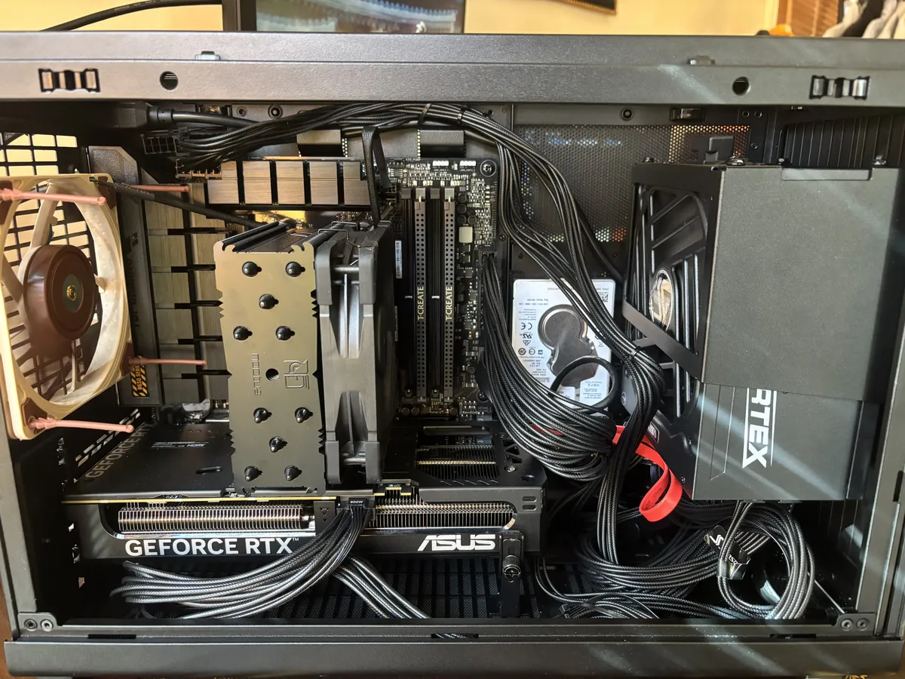
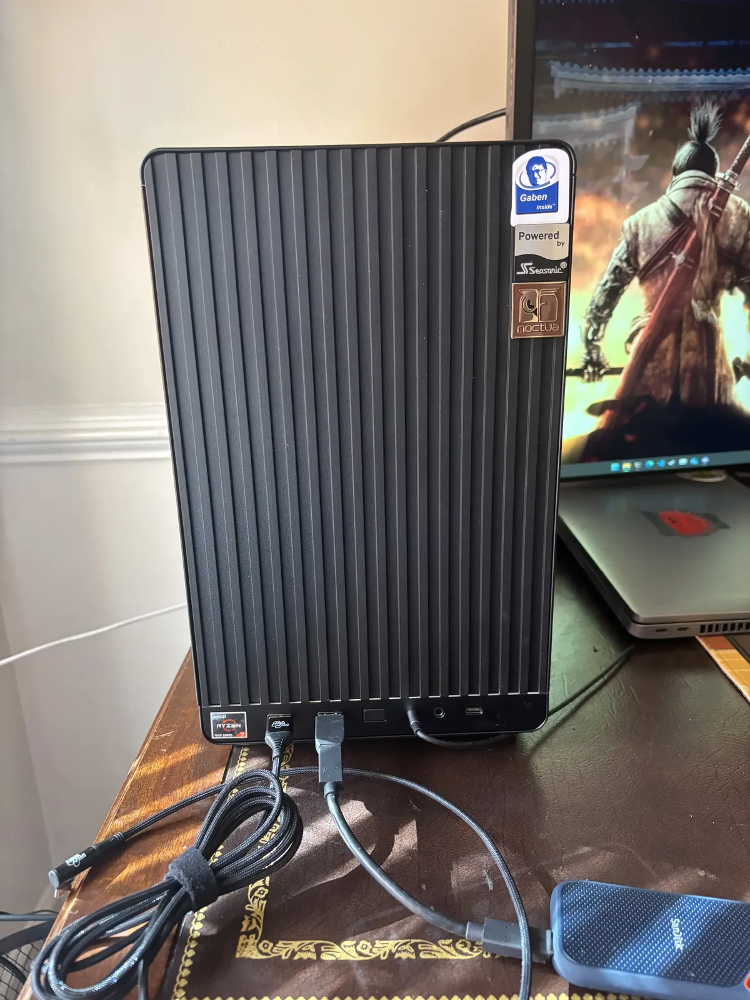

If you've checked out the [About](/about) section of my website, you'll see a couple of pictures of my setups, one in the basement of my childhood home during COVID and the other in my dorm at the senior year of college. Aside from the different locations, display configurations, and other knick-knacks, one thing remained constant: the ThinkPad.

```image
src="./thinkpad_mentioned.webp",1200x800
THINKPAD MENTIONED!!!!!
```

When I started college, my institution ([Rose-Hulman](https://www.rose-hulman.edu/index.html)) has you pay a fee freshman year for a laptop that comes with all the school software but is otherwise yours to keep. Their choice for that year (and the next couple of years from what I could gather), was the **ThinkPad P1 (Gen 1)**. At the time, this was when the [Nvidia GeForce RTX 2000 series refresh](https://en.wikipedia.org/wiki/GeForce_20_series) was happening, Intel released [10th Gen Comet Lake processors](https://en.wikipedia.org/wiki/Comet_Lake) but was losing ground to AMD with the improvements in [2nd Generation Ryzen processors on Zen 2](https://en.wikipedia.org/wiki/Zen_2); Apple was still developing their [Apple Silicon](https://en.wikipedia.org/wiki/Apple_M1) which would be announced the next year and change the computing landscape with its shift to [ARM](https://en.wikipedia.org/wiki/AArch64#ARMv8.4-A)/[RISC-based](https://en.wikipedia.org/wiki/Reduced_instruction_set_computer) computing. Also, this was before Windows 11 and mainstream "AI/ML" products and the surge in minimum computer requirements. I could continue framing the history and landscape of this time, but this gives a fairly broad picture.

The nice thing about [ThinkPads](https://en.wikipedia.org/wiki/ThinkPad) is that they are designed for enterprises which need more compute or reliability. This comes with many advantages ranging from choice of reliable/high-performance parts, ease of repairability (compared to most consumer laptops), and dedicated warranty plans for businesses (if you buy it, but the laptop fee included a 4-year accidental damage plan which I had to use a lot). However, not all ThinkPads are made equal, and it really depends on what a company/administrator is looking for when they want to deploy thousands of laptops to people that need them. Here is what my ThinkPad Model was configured with:

- Intel i7-8750H (Coffee Lake)
- Nvidia Quadro P1000 - 4GB VRAM
- 16 GB DDR4 RAM - 2666 MT/s
- 500 GB NVMe SSD
- Windows 10 Enterprise (This is important)


```image
src="./thinkpad_lid.webp", 1200x900
The lid of the Thinkpad. With all the stickers it accumulated
```

For what it's worth, it is a pretty good computer for the time and what is expected for engineering students to need: Above-average processing power and discrete graphics with an increase compute focus (the Quadro/RTX are known for this). Some pain points like the RAM and SSD were there, but that was more of a "me" thing; I ended up adding a [Seagate FireCuda 510 2TB SSD](https://www.seagate.com/support/internal-hard-drives/ssd/firecuda-ssd/) and making that my main boot drive, otherwise I basically relied on the [Windows page file](https://learn.microsoft.com/en-us/troubleshoot/windows-client/performance/introduction-to-the-page-file) if I ever ran out of memory (which is often). Aside from the school software, SDKs, toolchains, and VMs I had running on this, I also played (so many) video games on it. I mean have you seen my Steam library?

```image
src="./game_count.png", 540x359
This is a cry for help
```

Fun fact, I played [Cyberpunk 2077](https://www.cyberpunk.net/us/en/) on this computer at launch at the lowest settings with an average 20 FPS and got the worst possible ending. Not a joke. In fact, one of the first AAA games I played - [Watch Dogs 2](https://store.steampowered.com/app/447040/Watch_Dogs_2/) (phenomenal game) - I played on an also underspec'd IdeaPad at the lowest settings and beat the game. I still enjoyed it because I'm "quirky" like that, but it's not the only thing I've tried throwing at this computer with an unexpected level of success:

- 150 GB of Fallout 4 mods (setup is lost to the ether unfortunately)
- Cities Skylines 1 saves that would use like 22GB of virtual memory
- 250 some Chromium-browser tabs opened at once
- Elden Ring at launch, but it was so laggy that enemies would disappear on screen (I have a literal recording of this)

When it comes to pushing the boundary on performance, this is what many would consider to be _shoving_ in some cases. As someone who started with fixing a boot-looping Windows XP from the turn of the century, I'm used to the amount of jank one needs to make older hardware perform better. Cooling pads, hockey table fans, [undervolting](https://throttlestop.net/), you name it I've probably tried it. But, there comes a point where all the hacks and workarounds just aren't worth it anymore.

It's been five years. While ThinkPads can last longer than that, I think I need something a bit stronger for the long run.

## Pulling the trigger

I'll be honest, I was going to wait at least one more year before I chose to replace the ThinkPad. But then _[a major political event](https://en.wikipedia.org/wiki/2024_United_States_presidential_election)_ happened and suddenly questions about increasing costs in all points of life arose, especially computer parts. According to the [International Trade Center](https://www.intracen.org) (ITC), [the US only accounted for 4.5% of Semiconductor exports in 2023 (not including domestic sales), whereas China + Taiwan accounted for ~51% of exports (also not including domestic sales)](https://www.trademap.org/Country_SelProduct.aspx?nvpm=1%7c%7c%7c%7c%7c8542%7c%7c%7c4%7c1%7c1%7c2%7c1%7c1%7c2%7c1%7c1%7c1). And with the inflammatory rhetoric around trade and [tariffs](https://en.wikipedia.org/wiki/Tariff) you can't tell what is going to skyrocket in price until you need it. I could be a worry-wart about this (diagnosed OCD/anxiety here) but I decided I rather bite the bullet now than tank a shotgun slug later.

So I set a budget of $2000 USD and started making lists on [PCPartPicker](https://pcpartpicker.com). It didn't take long to generate what effectively was this final list (I worked with someone at [Micro Center](https://www.microcenter.com/) to adjust for better deals at the time):

- Case: Lian Li A3-mATX
- CPU: AMD Ryzen 7 7700X (8 Core @ 4.5GHz)
- Cooler: Noctua NH-U12S (chromax.black)
- MB: Asus TUF Gaming B650M-PLUS Wi-Fi (mATX AM5)
- Memory: TeamGroup T-Create Expert 2x16GB DDR5 6000 MT/s CL-30
- Storage: SK Hynix Platinum P41 - 2TB PCIe 4.0 (4 Lane)
- GPU: Asus PRIME OC GeForce RTX 4070 SUPER - 12GB VRAM
- PSU: Seasonic VERTEX PX-1000 (1000W, 80+ Platinum)

Here is a copy of the build on PCPartPicker for more details about the parts I used: https://pcpartpicker.com/user/FaceFTW/saved/#view=Dnmgzy

```image
src="./my_son.webp", 1200x1600
my son :)
```

Couple of interesting factors about this build
- I wanted something small and quiet.
  - I didn't want to do a full-blown ITX build for my first build since I knew it would be a massive pain overall with the tight clearances and planning.
  - Noctua fans are always the best when it comes to cooling while remaining quiet, so it was a no-brainer pick.
  - Quiet also means the minimum amount of RGB possible. By avoiding RGB the parts have reduced costs and have one less point of failure; also don't have to worry about configuring all the parts to work together.
- Parts are not the top-echelon but are still competitive
  - The main use cases I have are software development, gaming, and the occasional CAD/3D modeling for 3D Printing. More CPU cores and the Ryzen's overall dominance in multi-threading made the most sense overall.
  - I chose the 4070 SUPER is primarily budget and also use-case related. I still only use 1080p monitors that cap out at 75Hz refresh rate and have no intention to upgrade that soon, so I don't need all that raw graphics power just to play a game.

Here are pictures of the final build! I'm excluding a formal setup picture since I'm still adjusting things around, plus it's temporary while I save for an apartment.

```image


<figcaption>Please ignore the rat's nest. Also I can't believe they just give metal emblems with some of these things.</figcaption>
```

And the benchmarks? Well I ran a bunch of [3DMark](https://www.3dmark.com) tests, and I'm very happy with the higher numbers. Plus, I only heard the CPU fan spin up when under a reasonable load.

```image
src="./3dmark.webp", 607x916
The numbers Mason. They actually mean something.
```

Thanks for reading! I've got another post in the works about the history of this website's design that was in the works, but then this happened, and I wanted to nerd out about it. Stay tuned!