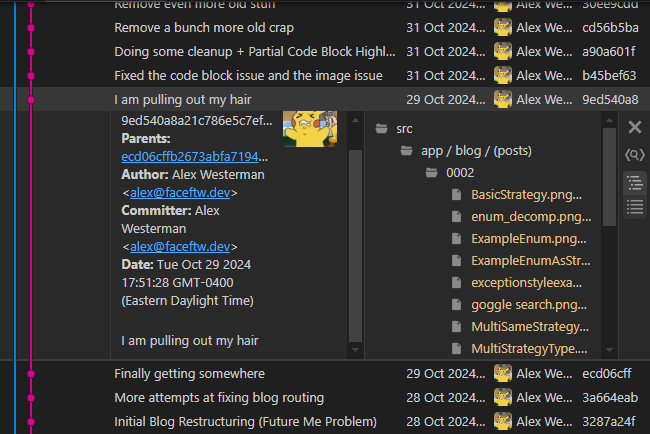

# From the Archives: Why I revised this Website 4 Times

_A history of this website and anecdotes of the pains of modern web development_

Recently, I upgraded this entire website with yet another fresh coat of paint. Originally started as a project for an introductory web development course during college, I kept adding to it and improving it to do something new: code-less additions of new projects, refining visuals for mobile, supporting _this very blog_. But each time I had to make a "radical change" like the ones I mentioned it always involved migrating to the next big thing. It's been over 3 years of this site being upgrade and with the creation of this blog (`ref_cycle`) I thought it would be an interesting retrospective in terms of what was great about certain revisions, and what could be better (both design and my experience with the tools I used).

So sit back and get your snack of choice, time for another trip back in time.

> EDITORS NOTE (aka me)
> This article has been in the work for a while now, and while I would love to try and update the old sites to newer versions of the frameworks to see how I was bad at web development previously it would take a lot longer. It's also been through much restructuring in an attempt to be more "palatable" for people who don't have ADHD like me.
>
> The section talking about bundle sizes and profiling page loading is not going to reflect the latest versions of the mentioned frameworks and should be taken with healthy skepticism. But you should be doing that with most information on the internet anyway right?

## A Walk Down Memory Lane

This website first started as most websites did back in the early days of the web: pure HTML, CSS, and a sprinkle of JS.

:::image

<figcaption>The first ever version of the website - a humble beginning</figcaption>
:::

This site is actually not that bad from the looks of it. Aside from the raw HTML that makes the code look scary, there is a lot to like visually. At this stage of the site, there was not much stuff I wanted to show; I didn't have many projects to show and also thought writing for fun was cringe (the irony). The main purpose was to effectively serve as a "second" resume for people to look at, especially as a demonstration of skill.

This version of the site used [Bootstrap (4?)](https://getbootstrap.com/) with a dark theme from [Bootswatch](https://bootswatch.com/), which I like and dislike (compared to [Tailwind](https://tailwindcss.com/)). Bootstrap is great with things like simple layouts and defining things like the cards for projects. For the most part, it's also fairly quick to set up, just include the Bootstrap CSS bundle as a `link` tag, and you are basically off to the races. The only major thing is that when you need to deviate from the standard `container` and other elements you have to start writing more of your own CSS, which increases some confusion on what is from Bootstrap and what I wrote (Tailwind does solve this problem somewhat with its configuration system but not a perfect solution).

At this time, I started taking on more projects, courses at college, and internships. Plus, HTML is the kind of language where you always feel like you want to write _less of it_. I mean, use inspect element on a modern webpage, and you'll see an absurd number of `div`s and nesting. I'd rather not spend time maintaining that if I could.

Luckily, this was around the time I started to learn my first web framework.

:::image

<figcaption>The Angular Revision - A Big New Step</figcaption>
:::

The first web framework I learned was [Angular](https://angular.dev) (not the ancient AngularJS), the web framework from Google. Compared to the raw HTML/CSS/JS combination that this website started with, Angular is what I consider to be an "augmentation" of the paradigm. With the [component model](https://angular.dev/essentials/components), first-class support for [Material Design](https://m3.material.io/), and easier reactive programming via [RxJS and observer patterns](https://rxjs.dev), it became the first choice for some of the projects I did in the same web design course.

Overall, this isn't a terrible website. Some of the elements are not well formatted, but I see that as more of my lack of thinking about "aesthetics" and more "it works". I even added a system with JSON and [JSON Schema](https://json-schema.org/) (for IDE validation) to serve as a static data for my projects list and resume. For my first foray into Angular (for a project outside the primary use cases), it's not a bad site. _But hindsight is 20/20 and there were some glaring issues_.

:::image

<figcaption>The React Revision - More of the Same</figcaption>
:::


After learning [React](https://react.dev) from an internship and liking it a lot, I made the decision to rewrite the entire site (again). I _**love**_ React (after hating it initially). It's a much nicer framework that strips out many of the things that I wasn't using in Angular and focuses purely on the concept of components from a functional perspective; It changes perspective with thinking more about "how does this piece work with respect to the whole design" rather than "I have these templates that change with user interaction". Sure, you need to add packages for more common features like static routing, but I personally prefer having a small "core of functionality" to build and compose with. This philosophy is also why I migrated from [MUI](https://mui.com/) (the Material Design framework for React) to [shadcn/ui](https://ui.shadcn.com/), [react-router](https://reactrouter.com/) to [wouter](https://github.com/molefrog/wouter), and cut NPM packages where possible over the year-or-so of developing the website. I thought this would be the last "migration"

However, starting the blog became an impetus for considering a different solution. There were a set of _fundamental_ problems that were not easily solvable without doing a complete migration to a different solution.

## The "Next" Big Thing

I was skeptical about migrating to [Next.js](https://nextjs.org) initially as I thought it was fairly heavy-handed like Angular would be but with React flavoring. But the option to be flexible between [server-side rendering (SSR)](https://nextjs.org/docs/pages/building-your-application/rendering/server-side-rendering) or [static site generation (SSG)](https://nextjs.org/docs/pages/building-your-application/rendering/static-site-generation) was really appealing for my use case. Plus there were ways to improve blog writing by using [MDX] plugins; this system was a pain to configure until I realized [Tailwind Typography](https://github.com/tailwindlabs/tailwindcss-typography) was missing in order to merge with the Tailwind styling I've been using prior.

A quick overview of what SSR/SSG is for those who don't want to click the reference links, it's a different paradigm for web applications on how the server and client interact. Here is a rough flow diagram made by yours truly explaining the difference:

```text
   Client-Side Rendering Model
                                                                  ┌─────────────────┐
                                                                  │                 │
                                                                  │ Server gives    │
                                                                ┌►│ styles.css      ├──┐                 Loops as long as user is in page
                                                                │ │                 │  │         ┌──────────────────────────────────────────────────────────────┐
                                           ┌──────────────────┐ │ └─────────────────┘  │         │                                                              │
┌──────────────┐      ┌──────────────┐     │                  ├─┘                      │         ▼                                                              │
│              │      │              │     │ Client parses    │   ┌─────────────────┐  │ ┌─────────────────┐   ┌─────────────┐   ┌────────────────────┐  ┌──────┴───────┐
│ Client wants ├─────►│ Server gives ├────►│ page -           │   │                 │  └►│                 │   │             ├──►│                    │  │              │
│ /page        │      │ page.html    │     │ requests linked  ├──►│ Server gives    ├───►│ Client Renders  ├──►│ Client Runs ├──►│ Server Responds    ├─►│ Client JS    │
│              │      │              │     │ CSS/JS           │   │ bundle1.js      │    │ HTML            │   │ JS          ├──►│ to API requests    │  │ Alters Page  │
└──────────────┘      └──────────────┘     │                  ├─┐ │                 │  ┌►│                 │   │             ├──►│                    │  │              │
                                           └──────────────────┘ │ └─────────────────┘  │ └─────────────────┘   └─────────────┘   └────────────────────┘  └──────────────┘
                                                                │                      │                                       │ HTTP API Calls
                                                                │ ┌─────────────────┐  │                                       │
                                                                │ │                 │  │                                    On Load
                                                                └►│ Other Resources ├──┘                                 On Interaction
                                                                  │                 │
                                                                  └─────────────────┘

 ────────────────────────────────────────────────────────────────────────────────────────────────────────────────────────────────────────────────────────────────────────────
 ────────────────────────────────────────────────────────────────────────────────────────────────────────────────────────────────────────────────────────────────────────────


   Server-Side Rendering Model                                                                                    Loops as long as user is in page
                                                                        ┌─────────────────┐            ┌──────────────────────────────────────────────────────────────┐
                                                                        │                 │            │                                                              │
                                                                        │ Server gives    │            │                                 Doesn't Exist in Static      │
                                                                      ┌►│ styles.css      ├──┐         │                                Site Generation (Usually)     │
                                                                      │ │                 │  │         │                                         │                    │
                      ┌───────────────────┐      ┌──────────────────┐ │ └─────────────────┘  │         │                                         │                    │
┌──────────────┐      │                   │      │                  ├─┘                      │         ▼                                         │                    │
│              │      │ Server generates  │      │ Client parses    │   ┌─────────────────┐  │ ┌─────────────────┐   ┌─────────────┐   ┌─────────┴──────────┐  ┌──────┴───────┐
│ Client wants ├─────►│ HTML for page     │      │ page -           │   │                 │  └►│                 │   │             ├──►│                    │  │              │
│ /page        │      │ then sends to     ├─────►│ requests linked  ├──►│ Server gives    ├───►│ Client Renders  ├──►│ Client Runs ├──►│ Server Responds    ├─►│ Client JS    │
│              │      │ Client            │      │ CSS/JS           │   │ client.js       │    │ HTML            │   │ JS          ├──►│ to API requests    │  │ Alters Page  │
└──────────────┘      │                   │      │                  ├─┐ │                 │  ┌►│                 │   │             ├──►│                    │  │              │
                      └───────┬───────────┘      └──────────────────┘ │ └─────────────────┘  │ └─────────────────┘   └─────────────┘   └────────────────────┘  └──────────────┘
                              │                                       │                      │                                       │ HTTP API Calls
                              │                                       │ ┌─────────────────┐  │                                       │
                              │                                       │ │                 │  │                                 On Interaction
                              │                                       └►│ Other Resources ├──┘                                RARELY - On Load
                              │                                         │                 │                       Since Server should have done this already
                       Skipped in Static                                └─────────────────┘
                        Site Generation
```

For understanding how webpages actually get processed (regardless of this model), [MDN has a great article explaining everything in greater detail ](https://developer.mozilla.org/en-US/docs/Web/Performance/How_browsers_work) and is great documentation to read when learning how to make faster websites.

There are a couple of key differences (that are subtle in this representation to not be a gigantic flow diagram) that distinguish SSR from the more common "Client-Side Rendering" (CSR):

1. When the Client requests the page, SSR has the server perform all the initial JavaScript for loading the page instead of the Client. So things like calling a REST API and scaffolding whatever table or DOM tree from the API response is done by the server before it ever reaches the client.
    - This becomes more efficient when the data fetching operations or whatever API you use is integrated directly into the server that "serves" the HTML since it removes networking latency between endpoints
2. The JavaScript bundle that is sent to the client when they request it during HTML parsing is significantly different internally; The bundle served by SSR is significantly smaller since it contains just the JavaScript needed to alter page display and call modification operations (i.e. HTTP `POST` requests)
    - Aside from reducing network latency further with smaller transfer sizes, it also means less JavaScript processing time upfront. This is why there is a note noting that there is rarely "On Load" JavaScript executed under an SSR model since that work is already done by the server.
3. SSG is very similar to SSR except there is _usually_ no preprocessing from the server and no API requests from the client, hence the _static_ in the acronym. Resources are generated at compile-time and simply sent by the server under this model.
    - The diagram points to which stages are generally ignored under an SSG model.

Because Next.js uses SSR as the basis for its framework, it meant having to worry about [React Server Components](https://react.dev/reference/rsc/server-components). These are really cool because depending on how you choose to bundle/deploy your project the result of compilation differs; static data can be "pre-rendered" into the resulting bundle (which requires only minimum client-side JS for interactivity) while dynamic data can be rendered after fetching on the server and just give the client the rendering work. Given that all the resources of this site are available by compile-time, this means _significantly slimmer bundles and faster rendering_ while still preserving the design and feel of the site. I am actually glad that I made this transition despite all the hair-pulling.


:::image

<figcaption>I'm usually better at commit messages trust me</figcaption>
:::

## The Improvements?

First, I want to clarify that _these are not bad frameworks, just they don't work well for this kind of "effectively static" website_. All I really pay for is a domain from Cloudflare, and host using their [Pages](https://pages.cloudflare.com/) (at the free tier); There isn't any login middleware, CRM, backend database, nothing. Just statically hosted HTML, CSS, and JS.

> EDITORS NOTE (aka me):
> This website's hosting method changed over the years. First it was GitHub Pages, then I purchased a domain from Google Domains (now defunct and run by SquareSpace) and used that system. Then I started to use [Firebase](https://firebase.google.com) for hosting until I moved my domain to Cloudflare and set up the Cloudflare Pages project.
>
> A brief explanation of the reasoning is that while every service I used was free (except the domain registration obviously) GitHub Pages and Firebase Hosting is somewhat restrictive in their functionality. With Cloudflare, I'm able to handle how my site is hosted at a much deeper level and get stronger analytical insights into request usages. Plus there are other benefits like [Rules](https://developers.cloudflare.com/rules/) which can help with blocking annoying bots that try to scrape the site for vulnerabilities (this is more of an analytics issue).

This analysis will ignore the pure HTML and Angular versions of the site since they have other problems that make it an unequal comparison (for example, the Angular version has no code-splitting). Using the SSR/SSG vs CSR explanation from the previous section, here are a few areas that the migration from pure React to Next.js showed improvements in:

- HTML/CSS/JS File Sizes
- First Load JS Size
- Web Metrics (i.e. [Lighthouse](https://developer.chrome.com/docs/lighthouse))
- Page Loading Time

These are all related metrics but for different parts of the web page loading process from start to end. First, the reduced size of the HTML, CSS and JS provide a decrease in transfer time overall, and smaller JS by extension means less code that needs to be run on first load.


Here is the rough bundle sizing for the pure React version of the site:
```
vite v5.4.6 building for production...
✓ 3422 modules transformed.
dist/index.html                                 0.52 kB │ gzip:  0.35 kB
dist/assets/Picture1.webp                       5.21 kB
<... a bunch of images ...>
dist/assets/err_5.webp                          5.67 kB
dist/assets/hero.webp                         462.21 kB
dist/assets/index.css                          27.48 kB │ gzip:  6.02 kB
dist/assets/arrow-left-wd6aoGpn.js              0.33 kB │ gzip:  0.26 kB
dist/assets/index-Dsn0k6dh.js                   0.41 kB │ gzip:  0.29 kB
dist/assets/err_9-CMtuSuMJ.js                   0.58 kB │ gzip:  0.21 kB
dist/assets/badge-5ai2lK9d.js                   0.71 kB │ gzip:  0.37 kB
dist/assets/blog_list-C1rE-FtA.js               0.91 kB │ gzip:  0.49 kB
dist/assets/Blog-BKOfLdQ0.js                    1.00 kB │ gzip:  0.54 kB
dist/assets/Error404-CJ55vSE8.js                1.67 kB │ gzip:  0.70 kB
dist/assets/About-DfBpW-C4.js                   2.51 kB │ gzip:  1.25 kB
dist/assets/Projects-CaBAu5Yl.js                7.76 kB │ gzip:  4.35 kB
dist/assets/BlogPage-D7PpiPg1.js                7.84 kB │ gzip:  3.84 kB
dist/assets/xv6-BmNTcSDr.js                    15.30 kB │ gzip:  6.89 kB
dist/assets/Resume-Bscw4k5W.js                 15.82 kB │ gzip:  5.82 kB
dist/assets/Home-DkVT_end.js                   79.40 kB │ gzip: 32.98 kB
dist/assets/proxy-C197JKuH.js                 110.38 kB │ gzip: 36.15 kB
dist/assets/MarkdownRender-jXc2DL1j.js        236.53 kB │ gzip: 75.11 kB
dist/assets/index-CCNu7cRr.js                 251.26 kB │ gzip: 83.46 kB
✓ built in 6.70s
```
For reference, the `index-**.js` file is loaded by all pages, and other JS files are loaded depending on the route chosen. One of the "heavier" pages in this version is the actual blog pages themselves, since they use the `MarkdownRender-**.js` and also request the original markdown files; this comes close to 500KB of JavaScript, with minimal HTML. Links to other parts of the website simply request the other JavaScript bundles required for that route and re-render/load that page as needed, no additional HTML is ever sent by the server to the client. In fact, client-side React basically has a single HTML page that usually looks like this since it generates/renders the page after JS loading:

```html
<!DOCTYPE html>
<html lang="en">
<head>
	<meta charset="UTF-8" />
	<link rel="icon" href="favicon.ico" />
	<meta name="viewport" content="width=device-width, initial-scale=1.0" />
	<title>Alex Westerman's Portfolio</title>
	<link rel="stylesheet" href="https://fonts.googleapis.com/css2?family=Roboto" />
  <script type="module" crossorigin src="/assets/index-CCNu7cRr.js"></script>
  <link rel="stylesheet" crossorigin href="/assets/index.css">
</head>
<body>
	<div id="root"></div>
</body>
</html>

```
Using this last bit of JavaScript at the end of the "main" React file, it shows React uses that `div` with `id=root` to render the entire website under it:

```tsx
//Main.tsx

// ...
// Layout component definition + routing things
// ...

const root = ReactDOM.createRoot(document.getElementById('root') as HTMLElement);
root.render(
    <React.StrictMode>
        <Layout />
    </React.StrictMode>
);
```

That's enough of the pure React size analysis, time for the Next.js sizes. Since there is a different bundler used (`next` which uses things like [SWC](https://swc.rs/)), the structure of the files is significantly different, but the build logs instead break down the total size of resources needed to load a specific route (excluding images). A much nicer way to analyze sizes instead of having to profile things and remember how React works.

```
Route (app)                              Size     First Load JS
┌ ○ /                                    27.6 kB         150 kB
├ ○ /_not-found                          137 B           106 kB
├ ○ /about                               551 B           111 kB
├ ○ /blog                                6.54 kB         128 kB
├ ○ /blog/0001                           878 B           114 kB
├ ○ /blog/0002                           5.6 kB          124 kB
├ ○ /blog/0003                           1.46 kB         120 kB
├ ○ /blog/0004                           1.64 kB         120 kB
├ ○ /blog/0005                           894 B           119 kB
├ ○ /projects                            3.24 kB         121 kB
└ ○ /resume                              5.3 kB          118 kB
+ First Load JS shared by all            105 kB
  ├ chunks/4bd1b696-932c6735a295a20d.js  52.9 kB
  ├ chunks/517-e3663d5a07510414.js       50.5 kB
  └ other shared chunks (total)          1.98 kB
```

The first load JS is reduced by around 60% for _all pages_. If a page has specific JS that it needs for components like the collapsible sections in the resume or the carousels on the main page, it's added to that page's specific JS, sometimes even as part of the HTML. Not only that, the use of SSG means that each blog page being pre-rendered removes 230KB of extra JS _and_ inlines the generated HTML so it's immediately rendered by the browser. This can be verified by looking at the generated HTML for a blog page.


:::image

<figcaption>Look at all of that minified HTML</figcaption>
:::

Now, just because there is less JavaScript being processed on page load does not mean that the page loads faster; poorly optimized code is still poorly optimized even if it is smaller. This is where time metrics can be used for certain points of the web page being loaded. I won't go into significant detail in this post, but I recommend reading the [Chrome Developer docs](https://developer.chrome.com/docs/lighthouse/overview), the [web.dev section](https://web.dev/explore/learn-core-web-vitals) on Core Web Vitals, and the [web-vitals NPM package README](https://github.com/GoogleChrome/web-vitals) for more detailed information (in fact they helped me write this article). This [Cloudflare article](https://www.cloudflare.com/learning/performance/how-dcl-and-fcp-affect-seo/) also adds a metric not covered by the other docs and provides some motivation for it. Here are the metrics I want to focus on and why I care:

- DCL (`DOMContentLoaded`) - Indicates HTML is finished loading and serves as the start mark for JS loading
- FCP (First Contentful Paint) - Indicates the first partial render of the page visible to the user
- LCP (Largest Contentful Paint) - Indicates the largest partial render of the page visible to the user. This is something the user would see and assume the page is loaded.
- L (Page Loaded Marker) - Indicates when on-load JS is run

Using the performance tab in the Chromium browser DevTools (I use Microsoft Edge despite not using any AI features, but this applies to most Chrome-based browsers) and loaded each page using a 4G network throttling setting to make the impact of resource size more apparent given the localized hosting used for testing. Here are the metrics for the pure React site:

:::image

<figcaption>Pure React Profile Results</figcaption>
:::

Given the knowledge about how the pure React page loads, it's no surprise that the DCL and L metrics occur with nearly any delay. FCP occurring almost immediately after L is likely due to some usage of [React Suspense](https://18.react.dev/reference/react/Suspense) and the "fallback" UI being shown while the actual page is loading. What really sticks out is LCP occurring around 800ms after FCP, with the actual metric being 1.6 seconds. While [this is within the recommended metric for the value in general](https://web.dev/articles/lcp), there is a major problem demonstrated in this: the heavy reliance on JavaScript to actually render the markup. Consider an imaginary browser which is great at parsing and rendering HTML but terrible at running JavaScript; Under this kind of browser the website would render much slower because of this "critical path" requiring the JavaScript to be processed. Plus, with JavaScript and CSS usually fetched asynchronously as HTML is parsed means that there is time blocking the start of rendering; the HTML might be finished parsing and ready to render but the JS/CSS hasn't been fully received.

Time for the Next.js metrics, which look much better:

:::image

<figcaption>Next.JS Profile Results</figcaption>
:::

The final metric mark (L) is around 500ms faster (than LCP in the older version) and is actually the last thing that occurs; given the shift to using HTML over JS for page content. Also, DCL happens much earlier, and is then proceeded by FCP and LCP within 250ms (FP indicates first paint but in this case it's relatively empty). Here is a zoom-in on that section specifically:


<figure className="text-center flex">

<figcaption>DCL point to L point - Look at that timespan difference!</figcaption>
:::

Already, looking at the different rendering frames it is clear that as the page is loading there is much more content already rendered compared to the pure React version. Plus, the time between the FCP and LCP is 100ms compared to the ~600ms originally, which is a massive improvement despite the L point being further down the line.

Overall, the metrics show massive improvements. The move to more static-like resources instead of relying on React and JavaScript to render the page is a great move for a site that doesn't require dynamic data like this one.

## Conclusions

The moral of the story here is something that I find to be lacking sometimes in more professional contexts:

_**Meeting a speed requirement doesn't mean you shouldn't optimize further.**_

In this age of massive websites that feel like they get slower and slower and hog more and more resources it's a breath of fresh air when you find a site that just loads in a _snap_. Especially with [Electron](https://www.electronjs.org/) becoming the massive cross-platform basis for many apps and running full browser engines just to load what might be a simple native app, the masses are settling for slower and slower software. And AI models being integrated into applications that don't need it exacerbate this problem by increasing memory requirements which can cause further slowdowns with increased memory pressure/swapping.

I'm starting to rant, and many other people have talked about [the enshittification of the internet](https://open.substack.com/pub/garymarcus/p/the-imminent-enshittification-of?utm_campaign=post&utm_medium=email) already. As someone who didn't grow up with strong computers and did things to squeeze every ounce of performance out of the magic sand we tricked into thinking, _I refuse to remain complacent and will optimize things if I can_.


Thanks for reading! Next in line are potential rants about Python, AI, or maybe I'll take 6 months to learn OpenGL from scratch (not through an engine). I don't know, I'm going to get back to playing the [Indiana Jones game](https://store.steampowered.com/app/2677660/Indiana_Jones_and_the_Great_Circle/).


:::image

<figcaption>He said the thing!</figcaption>
:::
<br/>